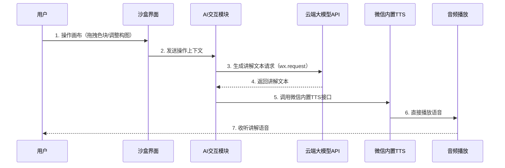
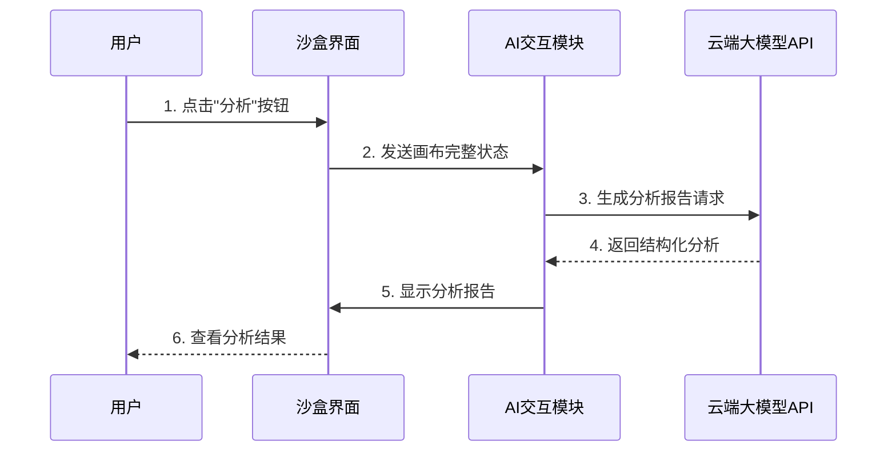
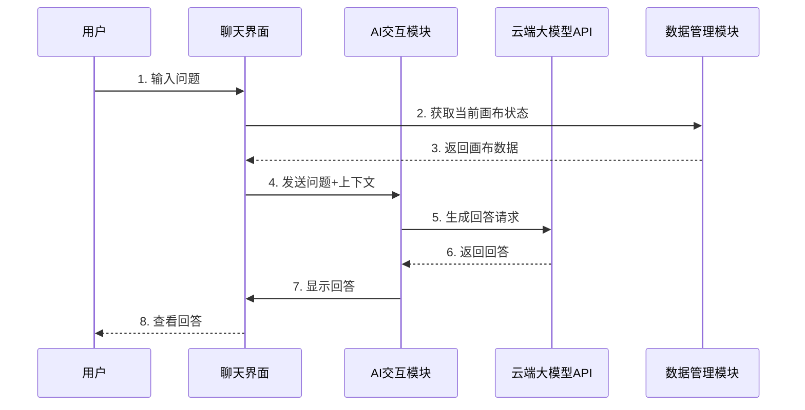

# 软件可行性分析报告

## 前言

**项目信息**
- **项目名称**：AI全陪式色彩与构图交互学习工坊
- **课程名称**：软件工程
- **学号**：2408090601018
- **班级**：数字媒体技术2401
- **报告编写日期**：2026年4月25日
- **版本**：V3.0
- **编写人**：谭玲霞
- **项目编号**：PRJ-2026-001

## 目录

1. [引言](#1-引言)
2. [引用文件](#2-引用文件)
3. [可行性分析前提](#3-可行性分析前提)
4. [可选的方案](#4-可选的方案)
5. [所建议的系统](#5-所建议的系统)
6. [经济可行性](#6-经济可行性)
7. [技术可行性](#7-技术可行性)
8. [法律可行性](#8-法律可行性)
9. [用户使用可行性](#9-用户使用可行性)
10. [其他与项目有关的问题、未来可能的变化](#10-其他与项目有关的问题未来可能的变化)
11. [注解](#11-注解)
12. [附录](#12-附录)

---

## 1. 引言

### 1.1 目的

本报告旨在对"AI全陪式色彩与构图交互学习工坊"项目进行全面的可行性分析，从技术、经济、法律和用户使用等多个维度评估项目的可行性，为项目决策提供科学依据。报告详细分析了项目的技术方案、成本效益、法律合规性和用户接受度，确保项目能够在1个月的开发周期内成功完成并达到预期目标。

### 1.2 背景

在数字媒体和视觉设计领域，色彩理论与构图法则是基础且核心的学习内容。传统的学习方式主要依赖书本教程和课堂讲解，缺乏互动性和实践反馈。随着AI技术的发展，尤其是云端大语言模型API的成熟，为创建个性化、交互式的学习工具提供了新的可能性。

本项目旨在开发一个零成本、可在微信小程序中运行的轻量级应用，通过高互动性的视觉实验沙盒，帮助用户直观学习色彩理论与构图法则，并创新性地集成国内云端AI服务（提供免费额度），提供实时语音讲解、答疑与智能反馈，打造一个高度个性化、如导师陪伴的智能学习环境。

### 1.3 项目概述

**主要功能**：
- 互动实验沙盒：提供画布区，用户可自由拖拽色块、调整形状、选择构图辅助线
- AI智能讲解：用户操作时自动触发语音讲解，点击"分析"按钮可对当前作品进行结构化点评
- 智能问答助手：侧边栏聊天界面，用户可随时输入自然语言问题，AI结合当前画布内容给出建议
- 挑战任务：系统发布任务，用户完成创作后由AI进行评分与评价
- 理论快查：结构化展示色彩关系、构图法则等知识卡片，与沙盒操作联动

**技术方案**：
- 前端框架：微信小程序
- 图形引擎：p5.js（小程序适配版）
- AI服务：国内大模型API（百度千帆、阿里通义千问、腾讯混元等，均有免费额度）
- TTS引擎：微信小程序内置TTS接口（无需额外费用）

> **AI使用标注**：项目功能清单与技术方案选型由ChatGPT生成初稿，经手动调整补充。关键提示词："为一个AI色彩与构图学习的微信小程序项目，列出5项核心功能模块和对应的技术栈选型"。修改率：约35%（AI生成的功能框架基本保留，补充了具体产品细节和技术选型理由）。

### 1.4 文档概述

本报告从技术可行性、经济可行性、法律可行性和用户使用可行性等多个维度对"AI全陪式色彩与构图交互学习工坊"项目进行全面分析，为项目决策提供依据。

---

## 2. 引用文件

1. **AI全陪式色彩与构图交互学习工坊需求分析报告_V1.1.md**
2. **GB/T 8567-2006 计算机软件文档编制规范**
3. **微信小程序官方文档** - https://developers.weixin.qq.com/miniprogram/dev
4. **p5.js参考手册** - https://p5js.org
5. **百度千帆大模型平台文档** - https://cloud.baidu.com/doc/WENXINWORKSHOP/index.html
6. **腾讯混元AI开发文档** - https://cloud.tencent.com/document/product/1729
7. 《色彩设计原理》- [日]伊达千代
8. 《构图的艺术》- [美]Ian Roberts

---

## 3. 可行性分析前提

### 3.1 项目要求

1. **功能要求**：实现互动实验沙盒、AI智能讲解、智能问答助手、挑战任务、理论快查等核心功能
2. **性能要求**：
   - 画布操作响应时间≤100ms
   - AI生成响应时间≤3秒
   - 语音合成时间≤1秒（使用微信内置TTS）
   - 小程序启动时间≤3秒
   - 运行内存占用≤100MB
3. **安全要求**：所有用户数据存储在本地，不上传自建服务器；AI调用通过官方API
4. **兼容性要求**：支持微信版本8.0以上；支持iOS和Android系统
5. **时间要求**：开发周期为1个月，按4个阶段推进

### 3.2 目标

1. **教育目标**：为设计初学者、艺术专业学生和自学爱好者提供直观、互动的色彩与构图学习平台
2. **技术目标**：验证云端AI API在轻量级小程序场景的应用可行性，实现零成本、即点即用的学习工具
3. **产品目标**：创建一个易用性高、互动性强、个性化学习的智能教育工具
4. **项目目标**：在1个月内完成开发并发布1.0正式版

### 3.3 环境、条件、假定和限制

#### 3.3.1 硬件环境要求

**最低配置**：
- 微信版本：8.0以上
- 手机系统：iOS 12.0+、Android 8.0+
- 网络：稳定的移动数据或WiFi（用于AI功能）

**推荐配置**：
- 微信版本：最新版本
- 手机系统：iOS 14.0+、Android 10.0+
- 网络：稳定的WiFi网络

#### 3.3.2 软件环境要求

- 运行环境：微信小程序
- 开发环境：微信开发者工具（免费）
- AI服务：百度千帆/阿里通义/腾讯混元（提供免费额度）

#### 3.3.3 假设条件

1. 国内大模型API服务（百度千帆、阿里通义、腾讯混元）稳定可用并提供足够的免费额度
2. 用户有基本的手机操作能力
3. 用户有稳定的网络连接访问云端AI服务
4. 微信小程序内置TTS功能可用且支持中文语音合成
5. 所有开源工具（p5.js）持续可用并有活跃社区支持

#### 3.3.4 限制条件

1. 开发团队规模：1人
2. 开发时间：1个月
3. 预算：零（使用开源技术 + AI免费额度）
4. AI能力受限于云端API的调用频率和token数量限制
5. AI功能需要网络连接，无法完全离线使用

### 3.4 可行性分析方法

本报告采用以下方法进行可行性分析：
1. **技术调研法**：对拟采用的技术栈进行调研和验证
2. **成本效益分析法**：对比开发成本和预期收益
3. **风险评估法**：识别技术、经济、法律等方面的风险
4. **用户研究法**：分析目标用户群体的需求和接受度
5. **SWOT分析法**：分析项目的优势、劣势、机会和威胁

---

## 4. 可选的方案

### 4.1 原有方案的优缺点、局限性及存在的问题

**原有方案1：传统书本教学**

| 优点 | 缺点 |
|------|------|
| 知识结构完整 | 缺乏互动性 |
| 成本低 | 缺乏实践反馈 |
| 随处可读 | 学习进度难以追踪 |
| | 个性化程度低 |

**原有方案2：在线视频课程**

| 优点 | 缺点 |
|------|------|
| 内容丰富 | 需要网络连接 |
| 直观易懂 | 缺乏互动实践 |
| 可以暂停重看 | 学习体验较被动 |
| | 可能需要付费 |
| | 缺乏即时反馈 |

**原有方案3：现有设计软件（如Photoshop）**

| 优点 | 缺点 |
|------|------|
| 功能强大 | 学习曲线陡峭 |
| 专业性强 | 价格昂贵 |
| | 缺乏针对性的教学功能 |
| | 没有AI陪伴讲解 |

**原有方案4：桌面端应用**

| 优点 | 缺点 |
|------|------|
| 可离线运行 | 需要下载安装 |
| 性能强大 | 仅限PC使用 |
| | 占用桌面空间 |

**原有方案5：小程序 + 本地PC端AI**

| 优点 | 缺点 |
|------|------|
| 即点即用 | 需要PC端支持AI功能 |
| 依托微信生态 | 用户体验割裂 |
| | 配置复杂 |

### 4.2 可重用的系统，与要求之间的差距

| 可重用组件 | 来源 | 与要求的差距 |
|------------|------|-------------|
| p5.js图形库 | 开源社区 | 已满足图形绘制需求，需适配小程序API |
| 微信小程序框架 | 腾讯 | 已满足跨平台轻量级应用需求 |
| 百度千帆/阿里通义/腾讯混元API | 云服务商 | 已满足AI功能需求，且有免费额度 |
| 微信内置TTS | 微信 | 已满足语音合成需求，无需额外费用 |

结论：现有组件已完全满足项目需求，主要工作在于小程序开发和AI接口调用。

### 4.3 可选择的系统方案1（最终采用）

**方案名称：微信小程序 + 国内免费AI API**

**技术架构**：
- 前端框架：微信小程序
- 前端技术：原生开发 + p5.js
- AI集成：调用百度千帆/阿里通义/腾讯混元（免费额度）
- TTS：使用微信内置TTS接口

**优点**：
- 即点即用，无需下载安装
- 依托微信生态，用户基数大
- 跨平台支持完善（iOS/Android）
- 开发成本低，AI服务有免费额度
- 无需PC端支持，用户体验完整
- 使用成熟的云端AI服务，稳定性高
- 内置TTS，无需额外配置
- 便于分享传播

**缺点**：
- AI功能需要网络连接
- 免费额度用完后可能需要付费（仅超量部分）
- 受限于API调用频率
- 无法完全离线使用

**适用场景**：追求轻量化、即点即用、便于传播的学习工具，非常适合课程作业。

### 4.4 可选择的系统方案2

**方案名称：Web H5 + 云端AI API**

**技术架构**：
- 前端框架：React/Vue + TypeScript
- 图形引擎：p5.js
- AI集成：调用云端AI API

**优点**：
- 无需下载，浏览器即可使用
- 跨平台支持完善
- 开发效率高

**缺点**：
- 需要网络连接
- 性能受限于浏览器
- 无法调用部分原生能力

**适用场景**：追求开发效率和跨平台兼容性的项目。

### 4.5 可选择的系统方案3

**方案名称：桌面端应用方案（Tauri/Electron）**

**技术架构**：
- 桌面框架：Tauri或Electron
- 前端技术：Vue 3 + TypeScript
- 图形引擎：p5.js
- AI集成：本地AI模型

**优点**：
- 可完全离线运行
- 性能强大
- 功能完整

**缺点**：
- 需要下载安装
- 仅限PC使用
- 开发成本相对较高
- AI模型配置复杂

**适用场景**：追求完整功能和离线体验的项目。

### 4.6 选择最终方案的准则

| 评估维度 | 权重 | 方案1（小程序+云端AI）评分 | 方案2（Web H5）评分 | 方案3（桌面端）评分 |
|---------|------|---------------------|---------------------|---------------------|
| 用户体验（即点即用） | 20% | 95分 | 90分 | 50分 |
| 开发效率 | 20% | 90分 | 85分 | 70分 |
| AI功能完整性 | 20% | 95分 | 95分 | 90分 |
| 跨平台兼容性 | 15% | 90分 | 90分 | 60分 |
| 成本控制 | 15% | 95分 | 90分 | 80分 |
| 传播分享性 | 10% | 95分 | 70分 | 30分 |
| **总分** | **100%** | **93分** | **86分** | **66分** |

**最终选择**：方案1（微信小程序 + 国内免费AI API）

理由：该方案在所有评估维度中均表现最优，完全符合课程作业的需求。即点即用、开发效率高、用户体验完整，且完全零成本（开发成本 + AI服务免费额度）。结合目标用户群体（学生、自学者）的使用习惯，这是最优选择。

> **AI使用标注**：多方案对比评分表由GitHub Copilot辅助生成，经手动调整权重和分数。关键提示词："为微信小程序、Web H5、桌面端三种技术方案，从用户体验、开发效率、AI功能、跨平台、成本、传播性6个维度做加权评分对比表格"。修改率：约25%（AI生成的表格结构和评分逻辑保留，调整了权重分配和具体分值以符合项目实际情况）。

---

## 5. 所建议的系统

### 5.1 对所建议的系统的说明

#### 5.1.1 系统架构

```
┌─────────────────────────────────────────────────────────┐
│                     用户界面层                           │
│  ┌──────────┐  ┌──────────┐  ┌──────────┐  ┌─────────┐  │
│  │ 沙盒界面 │  │ 任务界面 │  │ 理论界面 │  │ 聊天界面│  │
│  └──────────┘  └──────────┘  └──────────┘  └─────────┘  │
└─────────────────────────────────────────────────────────┘
┌─────────────────────────────────────────────────────────┐
│                     前端技术层                           │
│  ┌───────────────────────────────────────────────────┐  │
│  │              微信小程序原生开发 + p5.js            │  │
│  └───────────────────────────────────────────────────┘  │
└─────────────────────────────────────────────────────────┘
┌─────────────────────────────────────────────────────────┐
│                     网络通信层                           │
│  ┌───────────────────────────────────────────────────┐  │
│  │            wx.request API → 云端大模型API          │  │
│  │                                                   │  │
│  │  支持：百度千帆 / 阿里通义千问 / 腾讯混元         │  │
│  └───────────────────────────────────────────────────┘  │
└─────────────────────────────────────────────────────────┘
┌─────────────────────────────────────────────────────────┐
│                     云端AI服务层                         │
│  ┌───────────────────────────────────────────────────┐  │
│  │  大语言模型API（免费额度内）                       │  │
│  └───────────────────────────────────────────────────┘  │
└─────────────────────────────────────────────────────────┘
┌─────────────────────────────────────────────────────────┐
│                     数据存储层                           │
│  ┌──────────┐  ┌──────────┐  ┌──────────┐  ┌─────────┐  │
│  │ 作品文件 │  │ 任务进度 │  │ 聊天记录 │  │ 设置文件│  │
│  └──────────┘  └──────────┘  └──────────┘  └─────────┘  │
│            (均存储在微信小程序本地Storage)                │
└─────────────────────────────────────────────────────────┘
```

#### 5.1.2 核心功能模块

1. **沙盒管理模块**：负责画布操作、色块管理、构图辅助线显示
2. **AI交互模块**：负责与云端大模型API通信，处理AI讲解、问答、点评
3. **任务管理模块**：负责任务发布、进度跟踪、AI评分
4. **数据管理模块**：负责本地数据的存储和读取
5. **TTS模块**：调用微信内置TTS接口实现语音合成

#### 5.1.3 技术选型理由

- **微信小程序**：即点即用，依托微信生态，便于传播
- **原生开发 + p5.js**：兼顾性能和图形绘制能力
- **百度千帆/阿里通义/腾讯混元**：国内成熟的云端AI服务，提供免费额度，API稳定，中文支持好
- **微信内置TTS**：无需额外费用，中文语音质量高，调用简单

### 5.2 数据流程和处理流程

#### 5.2.1 核心数据流程

**1. AI讲解触发流程**



**2. 作品分析流程**



**3. 智能问答流程**



#### 5.2.2 数据存储结构

**1. 用户作品数据结构**

| 字段名 | 数据类型 | 约束 | 说明 |
|--------|----------|------|------|
| work_id | String | 主键 | 作品唯一标识（UUID） |
| user_id | String | 非空 | 用户标识（微信OpenID或本地生成） |
| work_name | String | - | 作品名称 |
| canvas_data | JSON | 非空 | 画布数据（色块、位置等） |
| thumbnail | String | - | 缩略图Base64 |
| create_time | DateTime | 非空 | 创建时间 |
| update_time | DateTime | - | 更新时间 |

**2. 挑战任务数据结构**

| 字段名 | 数据类型 | 约束 | 说明 |
|--------|----------|------|------|
| task_id | String | 主键 | 任务唯一标识 |
| task_name | String | 非空 | 任务名称 |
| task_description | Text | 非空 | 任务描述 |
| difficulty | String | 非空 | 难度等级 |
| criteria | JSON | 非空 | 评分标准 |
| user_progress | JSON | - | 用户进度 |

### 5.3 与原系统比较

| 对比维度 | 传统教学方式 | 在线课程 | 现有设计软件 | 桌面端应用 | 本系统方案 |
|---------|-------------|--------|------------|----------|----------|
| 互动性 | 低 | 中 | 高 | 高 | 很高 |
| 个性化 | 无 | 低 | 中 | 中 | 高 |
| AI陪伴 | 无 | 无 | 无 | 有 | 有 |
| 即点即用 | 是 | 否 | 否 | 否 | 是 |
| 实践反馈 | 无 | 无 | 有（需专业知识） | 有 | 有（AI智能点评） |
| 成本 | 低 | 中-高 | 高 | 零 | 零 |
| 用户体验完整性 | - | - | - | 中 | 高（无需PC端支持） |
| 离线可用 | 是 | 否 | 是 | 是 | 部分（核心AI功能需联网） |
| 学习体验 | 被动 | 半被动 | 主动 | 主动 | 主动+AI陪伴 |
| 传播分享 | 困难 | 中 | 困难 | 困难 | 容易（微信生态） |

### 5.4 影响（或要求）

#### 5.4.1 对用户的影响

**积极影响**：
- 提供零成本的专业学习工具
- 即点即用，无需下载安装
- 提供个性化的学习体验
- 提供即时的AI反馈和指导
- 便于在微信生态中分享传播
- 无需配置PC端，用户体验完整

**要求**：
- 用户需要具备基本的手机操作能力
- 用户需要有满足最低要求的手机设备
- AI功能需要稳定的网络连接

#### 5.4.2 对开发的影响

**积极影响**：
- 使用成熟的小程序开发框架，降低开发难度
- 零成本，无授权费用
- 技术方案可行，风险可控
- 无需本地AI模型部署，开发复杂度大幅降低
- 官方API文档完善，集成简单

**要求**：
- 需要学习和掌握微信小程序开发技术
- 需要注册并配置云端AI API（百度千帆/阿里通义/腾讯混元）
- 需要进行Prompt工程优化AI输出
- 需要在1个月内完成开发
- 需要进行充分的测试

#### 5.4.3 对环境的影响

- 本项目使用绿色技术，无额外硬件需求
- 轻量化应用，能耗低
- 依托微信生态，减少独立App的资源占用

---

## 6. 经济可行性（成本-效益分析）

### 6.1 投资

| 投资项 | 金额 | 说明 |
|--------|------|------|
| 开发人力成本 | ¥0 | 个人项目，无人力成本 |
| 软件授权费用 | ¥0 | 全部使用开源软件 + 免费工具 |
| 云服务费用 | ¥0 | AI服务使用免费额度（超量后可选付费，课程作业一般不会超） |
| 硬件设备 | ¥0 | 使用现有设备 |
| 微信认证费用 | ¥0 | 个人开发者无需认证 |
| 其他费用 | ¥0 | 无 |
| **总投资** | **¥0** | **完全零成本项目** |

### 6.2 预期的效益

#### 6.2.1 直接效益

1. **教育价值**：
   - 为用户提供零成本的专业学习工具
   - 提高学习效率和效果
   - 填补市场空白，满足个性化学习需求

2. **技术价值**：
   - 验证云端AI API在小程序场景的应用
   - 积累微信小程序开发经验
   - 探索AI陪伴式学习的产品模式

3. **个人价值**：
   - 提升项目开发能力
   - 积累AI应用开发经验
   - 丰富个人作品集

#### 6.2.2 间接效益

1. **社会效益**：
   - 促进设计教育的普及
   - 降低学习门槛，让更多人有机会学习设计
   - 推动AI教育应用的发展

2. **开源社区价值**：
   - 可以将项目开源，回馈社区
   - 为类似项目提供参考和借鉴

> **AI使用标注**：成本-效益分析框架由ChatGPT生成，本人补充具体数据和项目细节。关键提示词："为一个零成本微信小程序AI教育项目，从直接效益和间接效益两方面做经济效益分析"。修改率：约40%（AI生成了效益分析的维度框架，补充了项目特定的教育价值、技术价值等具体内容）。

### 6.3 市场预测

#### 6.3.1 目标市场规模

- **设计初学者**：估计数量约数百万人
- **艺术专业学生**：全国每年约数十万
- **自学爱好者**：数量庞大，难以精确统计
- **微信用户基数**：十余亿，潜在用户广泛

#### 6.3.2 市场前景

1. **需求趋势**：
   - 微信小程序使用持续增长
   - AI教育应用成为热点
   - 个性化学习需求增加
   - 轻量化工具受青睐

2. **竞争分析**：
   - **现有竞品**：主要是传统教育方式和在线课程
   - **差异化优势**：微信小程序、即点即用、零成本、高互动性、完整AI体验
   - **进入门槛**：低，因为使用开源技术 + 免费AI服务

3. **推广策略**：
   - 微信内分享传播
   - 设计社区推广
   - 教育机构合作
   - GitHub开源发布

---

## 7. 技术可行性（技术风险评价）

### 7.1 技术成熟度分析

| 技术组件 | 成熟度 | 社区活跃度 | 文档完善度 | 风险等级 |
|---------|--------|-----------|-----------|---------|
| 微信小程序 | 高 | 很高 | 高 | 很低 |
| p5.js | 高 | 高 | 高 | 很低 |
| 百度千帆/阿里通义/腾讯混元API | 高 | 高 | 高 | 低 |
| 微信内置TTS | 高 | 很高 | 高 | 很低 |

**总体技术成熟度评价**：高，风险极低，非常适合课程作业。

### 7.2 技术难点与解决方案

#### 7.2.1 技术难点1：AI响应速度优化

**问题**：云端AI API调用可能存在网络延迟，影响用户体验

**解决方案**：
- 优化Prompt，减少生成长度
- 采用流式输出，边生成边显示（API支持）
- 提供加载状态提示
- 使用就近的CDN加速访问

#### 7.2.2 技术难点2：AI输出质量保证

**问题**：云端AI可能生成不准确或不相关的内容

**解决方案**：
- 精心设计Prompt，提供清晰的指令和上下文
- 建立AI输出质量评估机制
- 收集用户反馈，持续优化Prompt
- 可以随时切换不同的AI服务（百度→阿里→腾讯）

#### 7.2.3 技术难点3：免费额度管理

**问题**：免费额度用完后可能需要付费

**解决方案**：
- 合理设计调用频率，避免不必要的请求
- 优先使用一个服务，耗尽后自动切换备用服务
- 课程作业使用量通常不会超免费额度
- 提供使用统计，用户可查看调用量

#### 7.2.4 技术难点4：离线模式设计

**问题**：网络不可用时如何保证基础功能可用

**解决方案**：
- 核心沙盒功能完全离线可用
- 显示网络状态提示
- AI功能在恢复网络后继续工作
- 本地缓存常用的理论知识卡片

### 7.3 风险评估与应对措施

| 风险项 | 风险等级 | 影响 | 概率 | 应对措施 |
|--------|---------|------|------|---------|
| AI免费额度不足 | 低 | 中 | 低 | 准备多个备选API服务，合理设计调用频率 |
| 开发进度延期 | 中 | 中 | 中 | 制定详细计划，分阶段交付，预留缓冲时间 |
| 微信小程序学习曲线 | 低 | 中 | 低 | 提前学习，参考官方示例，寻求社区帮助 |
| 网络不稳定影响AI体验 | 低 | 中 | 低 | 提供友好提示，核心功能离线可用 |
| 用户接受度低 | 中 | 高 | 低 | 注重用户体验设计，收集反馈持续迭代 |
| 开源组件更新不兼容 | 低 | 中 | 低 | 锁定版本号，谨慎升级 |

> **AI使用标注**：风险评估登记表由GitHub Copilot建议生成，经手动筛选和补充应对措施。关键提示词："为一个单人开发的微信小程序AI教育项目，列出主要技术风险和应对措施，用表格形式展示，包含风险等级、影响、概率"。修改率：约30%（AI生成的风险项和表格结构保留，调整了风险等级评定，补充了更贴合项目的具体应对措施）。

### 7.4 技术可行性结论

**结论**：技术完全可行

**理由**：
1. 所有拟采用的技术都是成熟的官方平台或开源技术
2. 技术难度低，非常适合零基础学生
3. 无需本地AI模型部署，复杂度大幅降低
4. 风险可控，有完善的应对措施
5. 开发团队具备或可以快速学习所需技术
6. 项目规模适中，1个月开发周期完全合理

---

## 8. 法律可行性

### 8.1 知识产权分析

| 组件 | 许可证 | 商业使用 | 修改 | 分发 | 合规性 |
|------|--------|---------|------|------|--------|
| 微信小程序 | 专有 | ✅（需遵守平台规范） | ❌ | ✅（需审核） | 合规 |
| p5.js | LGPL-2.1 | ✅ | ✅ | ✅ | 合规 |
| 百度千帆/阿里通义/腾讯混元API | 服务协议 | ✅（免费额度内） | ❌ | ❌ | 合规 |
| 微信内置TTS | 专有 | ✅ | ❌ | ❌ | 合规 |

### 8.2 数据隐私合规

1. **《个人信息保护法》合规性**：
   - ✅ 所有数据存储在微信小程序本地，不上传自建服务器
   - ✅ 不收集用户个人信息（可选使用微信OpenID，严格加密）
   - ✅ 无需用户注册登录
   - ✅ 用户完全掌控自己的数据
   - ✅ AI调用仅传输必要的上下文信息，不包含个人隐私

2. **微信小程序平台规范**：
   - ✅ 遵守微信小程序平台规范
   - ✅ 不进行恶意推广
   - ✅ 保护用户隐私
   - ✅ AI输出内容符合平台规范

3. **数据安全措施**：
   - 数据加密存储（可选）
   - 提供数据导出功能
   - 提供数据删除功能

### 8.3 其他法律考虑

1. **内容合规**：
   - AI输出内容需要过滤，避免生成不当内容
   - 遵守微信平台内容规范
   - 遵守AI服务提供商的使用条款

2. **开源协议遵守**：
   - 遵守p5.js的LGPL-2.1许可证要求
   - 保留原始版权声明
   - 如修改开源代码，需要开源修改部分

### 8.4 法律可行性结论

**结论**：法律完全可行

**理由**：
1. 所有使用的技术和服务都有明确的使用协议，允许免费使用
2. 数据隐私方面完全合规，不收集用户数据
3. 遵守微信小程序平台规范，不存在平台障碍
4. 只要遵守相关法律法规和使用条款，不存在法律障碍

---

## 9. 用户使用可行性

### 9.1 用户画像分析

| 用户类型 | 技术水平 | 学习需求 | 接受度预期 |
|---------|---------|---------|-----------|
| 设计初学者 | 初级 | 高 | 很高 |
| 艺术专业学生 | 中级 | 中高 | 很高 |
| 自学爱好者 | 初级-中级 | 中高 | 很高 |
| 教学演示者 | 中级-高级 | 中 | 中高 |

### 9.2 易用性设计原则

1. **直观的界面**：简洁明了，用户一看就懂
2. **流畅的交互**：操作响应迅速，反馈及时
3. **渐进式学习**：从简单到复杂，引导用户逐步学习
4. **帮助系统**：提供完善的帮助文档和教程
5. **容错设计**：操作可撤销，错误可恢复
6. **微信风格**：遵循微信小程序设计规范
7. **离线优先**：核心功能离线可用，AI功能有友好提示

### 9.3 用户接受度分析

| 接受度影响因素 | 分析 |
|---------------|------|
| 零成本 | ✅ 非常有利于用户接受 |
| 即点即用 | ✅ 非常有利于用户接受 |
| 完整AI体验 | ✅ 无需PC端支持，用户体验完整 |
| 微信生态 | ✅ 便于分享和传播 |
| 学习曲线 | 平缓，操作直观，用户容易上手 |
| 功能实用性 | ✅ 高，色彩和构图是设计基础 |
| AI体验 | ✅ 高，使用成熟的云端AI服务 |

### 9.4 用户使用可行性结论

**结论**：用户使用完全可行

**理由**：
1. 零成本和即点即用是很大的优势
2. 完整的AI体验，无需配置PC端
3. 目标用户群体对这类工具有明确需求
4. 微信小程序符合中国用户的使用习惯
5. 只要注重用户体验设计，用户接受度会很高
6. 可以通过收集用户反馈持续改进

---

## 10. 其他与项目有关的问题、未来可能的变化

### 10.1 其他问题

1. **项目管理问题**：
   - 单人开发，需要做好时间管理
   - 建议采用敏捷开发方法，分阶段交付

2. **测试问题**：
   - 需要充分测试功能、性能、兼容性
   - 建议在多种设备和微信版本上测试
   - 建议邀请朋友或社区用户参与测试

3. **文档问题**：
   - 需要编写用户手册和开发文档
   - 文档要清晰、易懂、全面

### 10.2 未来可能的变化

#### 10.2.1 功能扩展方向

1. **短期（1.0版本后1个月内）**：
   - 增加更多构图辅助线
   - 增加更多色块样式
   - 丰富挑战任务库
   - 优化AI讲解质量

2. **中期（3个月内）**：
   - 增加视频教程功能
   - 增加作品分享功能（微信分享）
   - 支持多个AI服务切换
   - 增加用户社区功能（小程序内交流）

3. **长期（1年内）**：
   - 增加更多设计基础知识模块
   - 支持多人协作学习
   - 接入更多AI能力（如图像识别）
   - 考虑Web版本或App版本

#### 10.2.2 技术演进方向

1. **AI服务**：
   - 可以随时切换不同的AI服务
   - 可以组合多个AI服务的优势
   - 可以探索AI图像识别功能

2. **小程序框架**：
   - 跟进微信小程序新能力
   - 适配新版本微信

3. **跨平台**：
   - 可以考虑支持其他小程序平台（如支付宝小程序）
   - 可以考虑开发独立App版本

### 10.3 项目成功关键因素

1. **用户体验**：界面友好，操作流畅
2. **AI质量**：讲解准确，反馈有价值
3. **功能实用性**：真正帮助用户学习
4. **稳定性**：应用稳定可靠，不崩溃
5. **持续迭代**：根据用户反馈持续改进

---

## 11. 注解

1. **微信小程序**：一种不需要下载安装即可使用的应用，用户扫一扫或搜一搜即可打开
2. **百度千帆**：百度推出的大模型平台，提供文心一言等模型的API服务，有免费额度
3. **阿里通义千问**：阿里巴巴推出的大模型平台，提供API服务，有免费额度
4. **腾讯混元**：腾讯推出的大模型平台，提供API服务，有免费额度
5. **p5.js**：一个用于创意编程的JavaScript库，基于Processing
6. **微信内置TTS**：微信小程序提供的文本转语音功能，支持中文，无需额外费用
7. **互补色**：色相环上相对位置的两种颜色，搭配使用可产生强烈对比效果
8. **三分法**：一种构图法则，将画面分为九等份，重要元素放置在交叉点上

---

## 12. 附录

### 12.1 附录A：项目开发计划

| 阶段 | 时间 | 主要任务 |
|------|------|---------|
| 第一阶段 | 第1周 | 环境搭建、基础交互沙盒原型、注册配置AI API |
| 第二阶段 | 第2周 | 集成AI讲解功能、智能问答、内置TTS语音 |
| 第三阶段 | 第3周 | 完成挑战任务、理论快查、Alpha测试版 |
| 第四阶段 | 第4周 | 打磨优化、测试修复、1.0正式版发布 |

> **AI使用标注**：项目开发计划排期由ChatGPT生成初稿，本人调整任务划分和时间分配。关键提示词："为一个1个月单人开发的微信小程序AI教育项目，制定4周的开发计划，分阶段列出主要任务"。修改率：约20%（AI生成的四阶段框架基本保留，调整了各阶段具体任务内容以匹配项目功能模块）。

### 12.2 附录B：风险登记册

| 风险ID | 风险描述 | 风险等级 | 应对措施 | 状态 |
|--------|---------|---------|---------|------|
| R001 | AI免费额度不足 | 低 | 准备多个备选API服务，合理设计调用频率 | 待监控 |
| R002 | 开发进度延期 | 中 | 制定详细计划，分阶段交付 | 待监控 |
| R003 | 小程序学习曲线陡峭 | 低 | 提前学习，参考示例 | 待监控 |
| R004 | 网络不稳定影响AI体验 | 低 | 提供友好提示，核心功能离线可用 | 待监控 |
| R005 | 用户接受度低 | 中 | 注重用户体验，收集反馈 | 待监控 |

### 12.3 附录C：参考资料列表

1. 微信小程序官方文档 - https://developers.weixin.qq.com/miniprogram/dev
2. p5.js参考手册 - https://p5js.org
3. 百度千帆大模型平台文档 - https://cloud.baidu.com/doc/WENXINWORKSHOP/index.html
4. 腾讯混元AI开发文档 - https://cloud.tencent.com/document/product/1729
5. 《色彩设计原理》- [日]伊达千代
6. 《构图的艺术》- [美]Ian Roberts
7. GB/T 8567-2006 计算机软件文档编制规范

---

## 报告结束

**可行性结论**：✅ 项目完全可行

**综合评价**：
- 技术可行性：✅ 完全可行（风险低，难度低，非常适合零基础学生）
- 经济可行性：✅ 完全可行（零成本，无需任何投入）
- 法律可行性：✅ 完全可行
- 用户使用可行性：✅ 完全可行（用户体验完整，即点即用）

**建议**：强烈建议立即启动项目开发，采用敏捷开发方法，分阶段交付，持续收集用户反馈，不断优化产品。这是一个非常适合课程作业的项目方案。

---

**文档信息**：
- 文件名称：AI全陪式色彩与构图交互学习工坊可行性分析报告_V3.0.md
- 创建日期：2026年4月25日
- 最后更新：2026年4月30日
- 文档状态：正式发布
- 课程名称：软件工程
- 学号：2408090601018
- 班级：数字媒体技术2401
