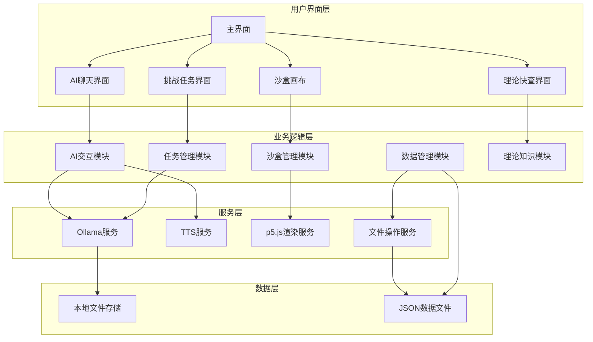
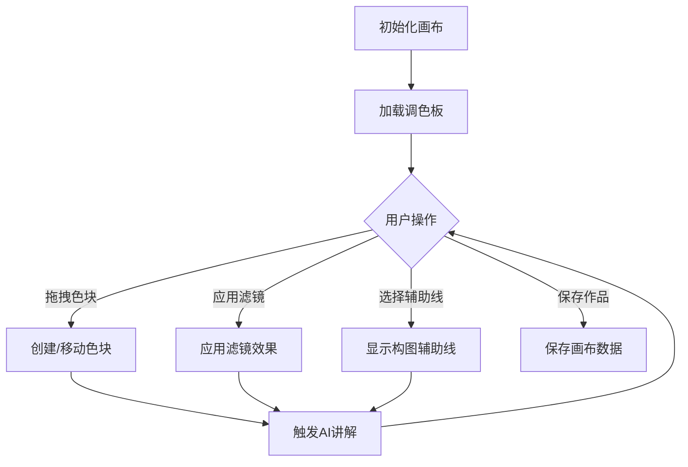
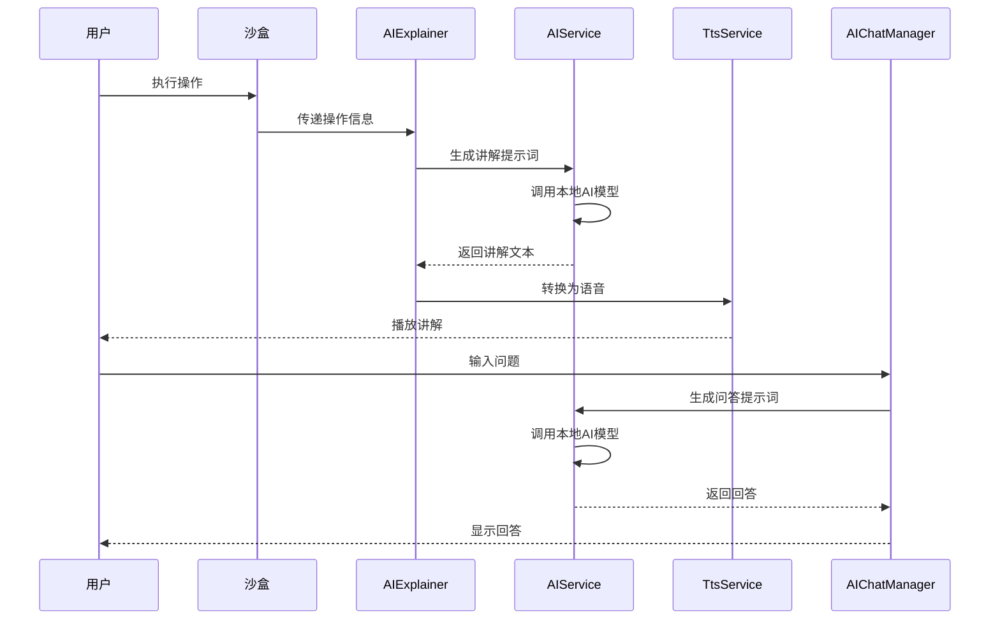
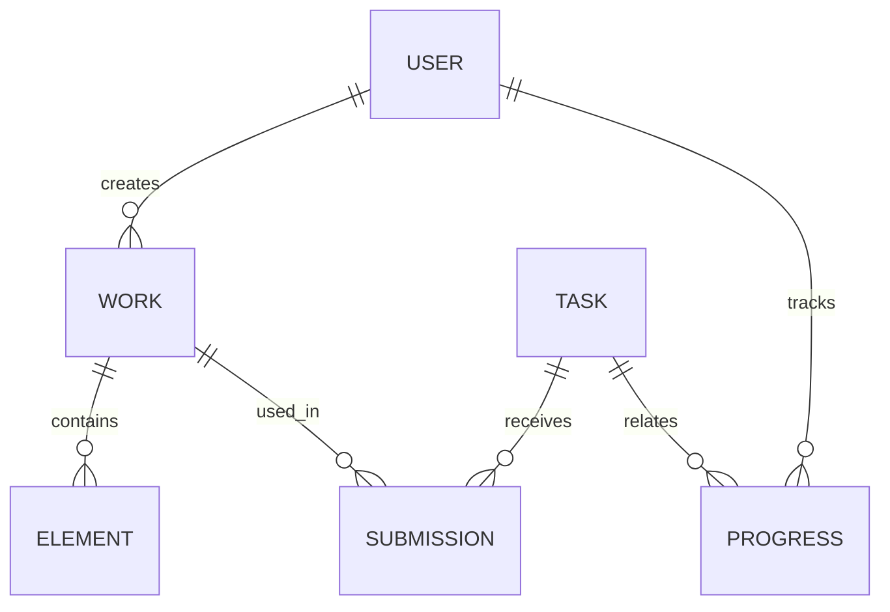
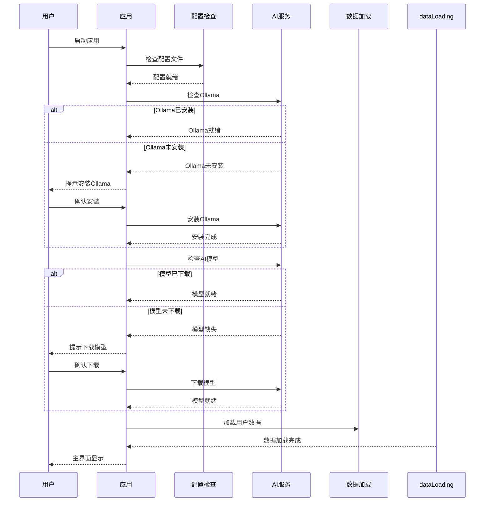
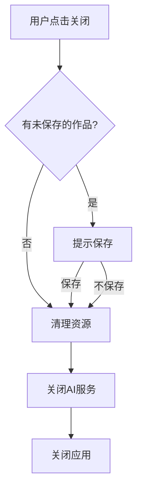

# 软件工程软件设计报告

***

## 📋 个人信息

| 字段 | 内容 |
|------|------|
| **学生姓名** | 谭玲霞 |
| **学号** | 2408090601018 |
| **班级** | 数字媒体技术2401 |
| **课程名称** | 软件工程 |
| **提交日期** | 2026-04-21 |
| **项目名称** | AI全陪式色彩与构图交互学习工坊 |

***

## 📝 版本修订记录

| 版本号 | 修订日期 | 修订内容 | 修订人 | 审核人 |
|--------|----------|----------|--------|--------|
| V1.0 | 2026-04-20 | 初始版本，格式模板 | 谭玲霞 | 谭玲霞 |
| V1.1 | 2026-04-21 | 完善报告结构，补充详细设计内容，增加Mermaid图表，符合GB/T 8567-2006规范 | 谭玲霞 | 谭玲霞 |

> **说明**：V1.0为格式模板，V1.1为完整版本，基于项目方案书和需求分析报告，详细描述了系统的软件设计方案。

***

## 📑 目录

1. [引言](#1-引言)
2. [设计概述](#2-设计概述)
3. [详细设计](#3-详细设计)
4. [数据库设计](#4-数据库设计)
5. [接口设计](#5-接口设计)
6. [运行设计](#6-运行设计)
7. [安全设计](#7-安全设计)
8. [其他设计](#8-其他设计)
9. [附录](#9-附录)

***

# 1 引言

## 1.1 编写目的

本文档旨在详细描述"AI全陪式色彩与构图交互学习工坊"系统的软件设计方案，包括系统架构、模块划分、数据结构、接口设计等内容，为开发团队提供具体的实现指导，确保系统开发的一致性和规范性。本文档的预期读者包括：

- 项目开发人员：了解系统设计方案，指导编码实现
- 项目评审人员：评估设计的合理性和可行性
- 测试人员：制定测试计划和测试用例
- 维护人员：了解系统结构，便于后续维护和扩展

## 1.2 背景

- **系统名称**：AI全陪式色彩与构图交互学习工坊
- **项目来源**：课程设计项目
- **项目背景**：本项目旨在开发一个零成本、可离线运行的桌面端应用。它通过高互动性的视觉实验沙盒，帮助用户直观学习色彩理论与构图法则，并创新性地集成本地AI模型，提供实时语音讲解、答疑与智能反馈，打造一个高度个性化、如导师陪伴的智能学习环境。
- **已知条件**：
  - 已完成需求分析报告（V1.1版本）
  - 技术选型已确定：Tauri + p5.js + Ollama + Kokoro-TTS
  - 开发周期为4个阶段

## 1.3 定义

| 序号 | 术语 | 定义 | 英文原文 |
|------|------|------|----------|
| 1 | 沙盒 | 一种安全的实验环境，用户可在其中自由操作而不会产生实际风险 | Sandbox |
| 2 | TTS | 文本转语音技术，将文字信息转换为语音输出 | Text-to-Speech |
| 3 | Ollama | 一个开源的大语言模型运行框架，支持本地部署 | Ollama |
| 4 | 互补色 | 色相环上相对位置的两种颜色，搭配使用可产生强烈对比效果 | Complementary Colors |
| 5 | 三分法 | 一种构图法则，将画面分为九等份，重要元素放置在交叉点上 | Rule of Thirds |
| 6 | 黄金螺旋 | 基于黄金比例的构图辅助线，引导视觉流动 | Golden Spiral |
| 7 | 本地AI模型 | 在用户设备本地运行的AI模型，无需联网即可使用 | Local AI Model |
| 8 | Tauri | 一个轻量级的跨平台桌面应用开发框架 | Tauri |
| 9 | p5.js | 一个用于创意编程的JavaScript库 | p5.js |
| 10 | Kokoro-TTS | 一个开源的文本转语音引擎 | Kokoro-TTS |

## 1.4 参考资料

| 序号 | 资料名称 | 作者/来源 | 日期/版本 |
|------|----------|-----------|-----------|
| 1 | GB/T 8567-2006 计算机软件文档编制规范 | 国家标准化管理委员会 | 2006 |
| 2 | Tauri官方文档 | Tauri Contributors | 2024 |
| 3 | p5.js参考手册 | Processing Foundation | 2024 |
| 4 | Ollama官方文档 | Ollama Team | 2024 |
| 5 | Kokoro-TTS项目文档 | Kokoro-TTS Team | 2024 |
| 6 | AI全陪式色彩与构图交互学习工坊需求分析报告 | 谭玲霞 | 2026-04-19 |

***

# 2 设计概述

## 2.1 设计目标

- **功能目标**：实现互动实验沙盒、AI智能讲解、智能问答助手、挑战任务、理论快查等核心功能
- **性能目标**：确保系统运行流畅，响应及时，AI生成响应时间≤3秒
- **质量目标**：保证代码质量，提高系统可维护性和可扩展性
- **安全目标**：保护用户数据安全，确保AI模型的安全使用
- **兼容性目标**：支持Windows 10/11、macOS 11.0+等主流操作系统

## 2.2 设计原则

- **模块化设计**：将系统划分为独立的功能模块，便于开发和维护
- **高内聚低耦合**：模块内部功能紧密相关，模块间依赖最小化
- **可扩展性**：设计时考虑未来功能的扩展需求
- **可重用性**：提取通用功能，提高代码复用率
- **用户体验优先**：界面设计简洁直观，交互流畅自然
- **性能优化**：优化算法和数据结构，提高系统响应速度

## 2.3 系统架构



## 2.4 模块划分

| 模块名称 | 主要职责 | 对应需求 |
|----------|----------|----------|
| 沙盒管理模块 | 画布操作、色块拖拽、滤镜应用、构图辅助线 | 互动实验沙盒功能 |
| AI交互模块 | 操作触发讲解、作品分析点评、智能问答 | AI智能讲解、智能问答助手功能 |
| 任务管理模块 | 任务发布、作品提交、AI评分评价 | 挑战任务功能 |
| 数据管理模块 | 作品存储、进度保存、数据导入导出 | 数据持久化需求 |
| 理论知识模块 | 知识卡片展示、操作联动、内容管理 | 理论快查功能 |
| 系统管理模块 | 应用配置、AI模型管理、版本更新 | 系统维护需求 |

***

# 3 详细设计

## 3.1 功能模块设计

### 3.1.1 沙盒管理模块设计

#### 3.1.1.1 模块概述

沙盒管理模块是系统的核心功能模块，负责提供一个可交互的视觉实验环境，用户可以在其中自由操作色块、调整形状、应用滤镜，并使用各种构图辅助线。该模块使用p5.js库实现图形渲染和交互。

#### 3.1.1.2 类设计

| 类名 | 功能描述 | 主要方法 | 参数说明 | 返回值 |
|------|----------|----------|----------|----------|
| CanvasManager | 画布管理器，负责画布的初始化和管理 | init(width, height)<br>clear()<br>save() | width: 画布宽度<br>height: 画布高度 | 无 |
| ColorBlock | 色块类，代表画布上的颜色块 | constructor(x, y, w, h, color)<br>draw()<br>updatePosition(x, y)<br>updateColor(color) | x, y: 位置坐标<br>w, h: 宽高<br>color: 颜色值 | 无 |
| FilterManager | 滤镜管理器，负责应用各种滤镜效果 | applyFilter(type, intensity)<br>removeFilter() | type: 滤镜类型<br>intensity: 强度 | 无 |
| CompositionGuide | 构图辅助线管理器 | showGuide(type)<br>hideGuide()<br>updateGuide(type) | type: 辅助线类型 | 无 |
| PaletteManager | 调色板管理器，提供颜色选择功能 | addColor(color)<br>removeColor(color)<br>getColors() | color: 颜色值 | 颜色数组 |

#### 3.1.1.3 流程图



### 3.1.2 AI交互模块设计

#### 3.1.2.1 模块概述

AI交互模块负责处理与AI相关的所有功能，包括操作触发讲解、作品分析点评和智能问答。该模块通过本地Ollama服务与AI模型交互，并通过TTS服务将AI生成的文本转换为语音。

#### 3.1.2.2 类设计

| 类名 | 功能描述 | 主要方法 | 参数说明 | 返回值 |
|------|----------|----------|----------|----------|
| AIService | AI服务管理器，负责与Ollama交互 | init()<br>generateResponse(prompt)<br>analyzeWork(workData) | prompt: 提示词<br>workData: 作品数据 | 生成的文本 |
| TtsService | 文本转语音服务 | init()<br>speak(text)<br>stop() | text: 要转换的文本 | 无 |
| AIExplainer | AI讲解器，负责生成讲解内容 | generateOperationExplanation(operation)<br>generateAnalysis(workData) | operation: 用户操作<br>workData: 作品数据 | 讲解文本 |
| AIChatManager | AI聊天管理器，处理用户问答 | sendMessage(message, context)<br>getHistory() | message: 用户消息<br>context: 上下文 | 聊天记录 |

#### 3.1.2.3 流程图



### 3.1.3 任务管理模块设计

#### 3.1.3.1 模块概述

任务管理模块负责发布挑战任务、接收用户提交的作品，并通过AI对作品进行评分和评价。该模块提供目标导向的练习，帮助用户巩固学习成果。

#### 3.1.3.2 类设计

| 类名 | 功能描述 | 主要方法 | 参数说明 | 返回值 |
|------|----------|----------|----------|----------|
| TaskManager | 任务管理器，负责任务的发布和管理 | loadTasks()<br>getTaskById(id)<br>getNextTask() | id: 任务ID | 任务对象 |
| Task | 任务类，代表一个挑战任务 | constructor(id, name, description, difficulty, criteria)<br>getCriteria() | id: 任务ID<br>name: 任务名称<br>description: 任务描述<br>difficulty: 难度<br>criteria: 评分标准 | 评分标准 |
| TaskSubmission | 任务提交类，处理用户提交 | constructor(taskId, workData, userId)<br>submit() | taskId: 任务ID<br>workData: 作品数据<br>userId: 用户ID | 提交结果 |
| TaskEvaluator | 任务评估器，负责AI评分 | evaluate(submission)<br>generateFeedback(workData, criteria) | submission: 任务提交 | 评分和反馈 |

### 3.1.4 数据管理模块设计

#### 3.1.4.1 模块概述

数据管理模块负责系统的数据存储和管理，包括用户作品、挑战进度、聊天记录等。该模块使用本地JSON文件存储数据，确保系统可离线运行。

#### 3.1.4.2 类设计

| 类名 | 功能描述 | 主要方法 | 参数说明 | 返回值 |
|------|----------|----------|----------|----------|
| DataManager | 数据管理器，负责数据的读写操作 | saveData(data, path)<br>loadData(path)<br>deleteData(path) | data: 数据对象<br>path: 文件路径 | 数据对象 |
| WorkManager | 作品管理器，负责作品的管理 | saveWork(work)<br>loadWork(id)<br>listWorks()<br>exportWork(id, format) | work: 作品对象<br>id: 作品ID<br>format: 导出格式 | 作品对象/作品列表 |
| ProgressManager | 进度管理器，负责任务进度的管理 | saveProgress(userId, taskId, progress)<br>loadProgress(userId)<br>resetProgress(userId) | userId: 用户ID<br>taskId: 任务ID<br>progress: 进度数据 | 进度数据 |
| ChatHistoryManager | 聊天记录管理器 | saveMessage(sessionId, message)<br>loadHistory(sessionId)<br>clearHistory(sessionId) | sessionId: 会话ID<br>message: 消息对象 | 聊天记录 |

### 3.1.5 理论知识模块设计

#### 3.1.5.1 模块概述

理论知识模块负责提供色彩理论和构图法则的知识卡片，并与沙盒操作联动，帮助用户随时回顾核心理论知识。

#### 3.1.5.2 类设计

| 类名 | 功能描述 | 主要方法 | 参数说明 | 返回值 |
|------|----------|----------|----------|----------|
| KnowledgeManager | 知识管理器，负责知识卡片的管理 | loadCards(category)<br>getCardById(id)<br>searchCards(keyword) | category: 分类<br>id: 卡片ID<br>keyword: 搜索关键词 | 卡片对象/卡片列表 |
| KnowledgeCard | 知识卡片类，代表一个知识条目 | constructor(id, title, content, category, relatedOperations) | id: 卡片ID<br>title: 标题<br>content: 内容<br>category: 分类<br>relatedOperations: 相关操作 | 无 |
| OperationLinker | 操作联动器，负责知识与操作的联动 | linkOperationToCard(operation, cardId)<br>getRelatedCards(operation) | operation: 用户操作<br>cardId: 卡片ID | 相关卡片列表 |

## 3.2 数据结构设计

### 3.2.1 作品数据结构

```javascript
// 作品数据结构
const workData = {
  workId: "uuid", // 作品唯一标识
  workName: "作品名称",
  canvasWidth: 800,
  canvasHeight: 600,
  elements: [ // 画布元素
    {
      elementId: "uuid",
      elementType: "colorBlock", // colorBlock, shape, filter
      positionX: 100,
      positionY: 100,
      width: 200,
      height: 150,
      color: "#FF5722",
      opacity: 1.0,
      filters: []
    }
  ],
  compositionGuide: "ruleOfThirds", // 构图辅助线类型
  createTime: "2026-04-21T10:00:00",
  updateTime: "2026-04-21T10:30:00"
};
```

### 3.2.2 任务数据结构

```javascript
// 任务数据结构
const taskData = {
  taskId: "uuid",
  taskName: "宁静氛围",
  taskDescription: "使用类似色营造宁静、和谐的画面氛围",
  difficulty: "入门",
  criteria: [
    {
      name: "色彩和谐度",
      weight: 0.4,
      description: "颜色搭配是否和谐"
    },
    {
      name: "构图合理性",
      weight: 0.3,
      description: "构图是否符合要求"
    },
    {
      name: "创意表达",
      weight: 0.3,
      description: "创意表达是否独特"
    }
  ],
  hints: ["尝试使用蓝色系的类似色", "注意画面的平衡"]
};
```

### 3.2.3 聊天记录数据结构

```javascript
// 聊天记录数据结构
const chatData = {
  sessionId: "uuid",
  messages: [
    {
      messageId: "uuid",
      role: "user", // user, assistant
      content: "怎么让画面更平衡？",
      timestamp: "2026-04-21T11:00:00"
    },
    {
      messageId: "uuid",
      role: "assistant",
      content: "您可以尝试将左侧的深色色块向中心移动，或在右侧添加一个相近大小的元素，以平衡视觉重量。",
      timestamp: "2026-04-21T11:01:00"
    }
  ]
};
```

### 3.2.4 进度数据结构

```javascript
// 进度数据结构
const progressData = {
  userId: "local",
  tasks: [
    {
      taskId: "uuid",
      status: "completed", // pending, in_progress, completed
      score: 95,
      submissionTime: "2026-04-21T12:00:00",
      feedback: "色彩搭配和谐，构图合理"
    }
  ],
  lastUpdated: "2026-04-21T12:00:00"
};
```

## 3.3 算法设计

### 3.3.1 色彩分析算法

| 算法名称 | 功能描述 | 时间复杂度 | 空间复杂度 | 实现说明 |
|----------|----------|----------|----------|----------|
| 色彩关系识别 | 识别画布中使用的色彩关系（互补色、类似色等） | O(n) | O(1) | 提取画布中所有色块的颜色，计算它们在色相环上的位置关系 |
| 色彩和谐度评估 | 评估色彩搭配的和谐程度 | O(n²) | O(1) | 基于色彩理论计算色彩之间的和谐度得分 |
| 构图平衡分析 | 分析画面的构图平衡情况 | O(n) | O(1) | 计算画面元素的视觉重量分布，评估平衡程度 |

### 3.3.2 AI提示词生成算法

| 算法名称 | 功能描述 | 时间复杂度 | 空间复杂度 | 实现说明 |
|----------|----------|----------|----------|----------|
| 操作分析提示词生成 | 根据用户操作生成AI提示词 | O(1) | O(1) | 基于操作类型和参数生成结构化提示词 |
| 作品分析提示词生成 | 根据作品数据生成AI分析提示词 | O(n) | O(1) | 提取作品特征，生成包含色彩和构图分析的提示词 |
| 问答上下文构建 | 构建智能问答的上下文 | O(n) | O(n) | 整合聊天历史和当前画布状态，构建完整上下文 |

### 3.3.3 任务评分算法

| 算法名称 | 功能描述 | 时间复杂度 | 空间复杂度 | 实现说明 |
|----------|----------|----------|----------|----------|
| 任务评分计算 | 根据评分标准计算任务得分 | O(n) | O(1) | 基于AI反馈和评分标准计算加权得分 |
| 进度更新算法 | 更新用户任务进度 | O(1) | O(1) | 根据任务完成情况更新进度数据 |

***

# 4 数据库设计

## 4.1 数据库概述

本系统采用本地文件存储方案，使用JSON格式存储所有数据，无需依赖数据库服务器。这种方案的优势在于：

- **零成本**：不需要额外的数据库服务
- **离线可用**：所有数据存储在本地，无需网络连接
- **易于部署**：无需配置数据库，直接运行应用
- **隐私安全**：数据不离开用户设备，保护隐私

## 4.2 数据模型



## 4.3 数据存储结构

### 4.3.1 作品文件结构

**文件路径**：`/data/works/{workId}.json`

| 字段名 | 数据类型 | 约束 | 说明 |
|--------|----------|------|------|
| workId | String | 主键 | 作品唯一标识 |
| workName | String | 非空 | 作品名称 |
| canvasWidth | Number | 非空 | 画布宽度 |
| canvasHeight | Number | 非空 | 画布高度 |
| elements | Array | 非空 | 画布元素数组 |
| compositionGuide | String | - | 构图辅助线类型 |
| createTime | String | 非空 | 创建时间 |
| updateTime | String | - | 更新时间 |

### 4.3.2 任务文件结构

**文件路径**：`/data/tasks/{taskId}.json`

| 字段名 | 数据类型 | 约束 | 说明 |
|--------|----------|------|------|
| taskId | String | 主键 | 任务唯一标识 |
| taskName | String | 非空 | 任务名称 |
| taskDescription | String | 非空 | 任务描述 |
| difficulty | String | 非空 | 难度等级 |
| criteria | Array | 非空 | 评分标准数组 |
| hints | Array | - | 提示信息数组 |

### 4.3.3 进度文件结构

**文件路径**：`/data/progress/local.json`

| 字段名 | 数据类型 | 约束 | 说明 |
|--------|----------|------|------|
| userId | String | 非空 | 用户标识 |
| tasks | Array | 非空 | 任务进度数组 |
| lastUpdated | String | 非空 | 最后更新时间 |

### 4.3.4 聊天记录文件结构

**文件路径**：`/data/chat/{sessionId}.json`

| 字段名 | 数据类型 | 约束 | 说明 |
|--------|----------|------|------|
| sessionId | String | 主键 | 会话唯一标识 |
| messages | Array | 非空 | 消息数组 |

### 4.3.5 知识卡片文件结构

**文件路径**：`/data/knowledge/{category}.json`

| 字段名 | 数据类型 | 约束 | 说明 |
|--------|----------|------|------|
| category | String | 非空 | 知识分类 |
| cards | Array | 非空 | 知识卡片数组 |

***

# 5 接口设计

## 5.1 外部接口

| 接口名称 | 功能描述 | 输入参数 | 输出参数 | 调用方式 |
|----------|----------|----------|----------|----------|
| Ollama API | 调用本地AI模型 | prompt: 提示词<br>model: 模型名称 | 生成的文本 | HTTP POST |
| TTS API | 文本转语音 | text: 文本<br>voice: 语音类型 | 音频流 | 本地函数调用 |
| p5.js Canvas API | 画布操作 | 各种绘图参数 | 画布渲染 | 本地函数调用 |

## 5.2 内部接口

| 接口名称 | 功能描述 | 输入参数 | 输出参数 | 调用模块 |
|----------|----------|----------|----------|----------|
| CanvasManager.init() | 初始化画布 | width: 宽度<br>height: 高度 | 无 | 沙盒管理模块 |
| ColorBlock.draw() | 绘制色块 | 无 | 无 | 沙盒管理模块 |
| AIService.generateResponse() | 生成AI响应 | prompt: 提示词 | 生成的文本 | AI交互模块 |
| TtsService.speak() | 播放语音 | text: 文本 | 无 | AI交互模块 |
| TaskManager.getTaskById() | 获取任务 | id: 任务ID | 任务对象 | 任务管理模块 |
| WorkManager.saveWork() | 保存作品 | work: 作品对象 | 保存结果 | 数据管理模块 |
| KnowledgeManager.loadCards() | 加载知识卡片 | category: 分类 | 卡片列表 | 理论知识模块 |

## 5.3 API设计

### 5.3.1 本地API

| API路径 | 方法 | 功能描述 | 请求参数 | 响应格式 |
|----------|------|----------|----------|----------|
| /api/ai/generate | POST | 生成AI响应 | {"prompt": "...", "model": "qwen2.5:0.5b"} | {"response": "..."} |
| /api/ai/analyze | POST | 分析作品 | {"workData": {...}} | {"analysis": "...", "score": 95} |
| /api/works | GET | 获取作品列表 | 无 | [{"workId": "...", "workName": "..."}] |
| /api/works/{id} | GET | 获取作品详情 | id: 作品ID | {"workId": "...", "elements": [...]} |
| /api/works | POST | 创建作品 | {"workName": "...", "elements": [...]} | {"workId": "..."} |
| /api/works/{id} | PUT | 更新作品 | id: 作品ID<br>{"elements": [...]} | {"success": true} |
| /api/works/{id} | DELETE | 删除作品 | id: 作品ID | {"success": true} |
| /api/tasks | GET | 获取任务列表 | 无 | [{"taskId": "...", "taskName": "..."}] |
| /api/tasks/{id} | GET | 获取任务详情 | id: 任务ID | {"taskId": "...", "description": "..."} |
| /api/progress | GET | 获取进度 | 无 | {"tasks": [...]} |
| /api/progress | POST | 更新进度 | {"taskId": "...", "status": "completed", "score": 95} | {"success": true} |
| /api/chat | POST | 发送消息 | {"sessionId": "...", "message": "..."} | {"response": "..."} |
| /api/chat/{sessionId} | GET | 获取聊天记录 | sessionId: 会话ID | {"messages": [...]} |
| /api/knowledge | GET | 获取知识卡片 | {"category": "color"} | {"cards": [...]} |

***

# 6 运行设计

## 6.1 运行环境

### 6.1.1 硬件环境

| 设备类型 | 最低配置 | 推荐配置 |
|----------|----------|----------|
| CPU | 4核心 | 6核心及以上 |
| 内存 | 8GB | 16GB及以上 |
| 硬盘 | 500MB可用空间 | 1GB可用空间 |
| 显卡 | 集成显卡 | 支持GPU加速 |
| 音频 | 音频输出设备 | 音频输出设备 |

### 6.1.2 软件环境

| 软件类型 | 软件名称 | 版本要求 | 备注 |
|----------|----------|----------|------|
| 操作系统 | Windows | 10/11 | 64位 |
| 操作系统 | macOS | 11.0+ | Intel/Apple Silicon |
| 运行时 | Node.js | 18.0+ | 用于开发环境 |
| 运行时 | Ollama | 最新版 | 首次启动时引导安装 |
| 依赖库 | p5.js | 1.7.0+ | 图形渲染 |
| 依赖库 | Kokoro-TTS | 最新版 | 文本转语音 |
| 框架 | Tauri | 2.0+ | 桌面应用框架 |

## 6.2 部署方案

### 6.2.1 安装包部署

- **Windows**：提供.exe安装包，包含应用主体和必要依赖
- **macOS**：提供.dmg安装包，支持Intel和Apple Silicon架构
- **首次启动**：引导用户下载AI模型（约300MB），或提供离线安装选项

### 6.2.2 便携版部署

- 提供无需安装的便携版本，解压即可使用
- 包含基础功能，AI模型需单独下载

### 6.2.3 开发环境部署

```bash
# 克隆仓库
git clone <repository-url>
cd ai-color-composition-workshop

# 安装依赖
npm install

# 开发模式运行
npm run dev

# 构建安装包
npm run build
```

## 6.3 启动与关闭

### 6.3.1 启动流程



### 6.3.2 关闭流程



## 6.4 异常处理

| 异常类型 | 处理方式 | 恢复措施 |
|----------|----------|----------|
| Ollama启动失败 | 提示用户检查Ollama安装 | 引导用户重新安装Ollama |
| AI模型加载失败 | 降级为基础功能模式 | 提示用户重新下载模型 |
| 数据文件损坏 | 使用备份数据 | 提示用户恢复数据 |
| 画布渲染错误 | 重置画布状态 | 提示用户保存当前作品 |
| 音频播放失败 | 禁用语音功能 | 仅显示文本讲解 |

***

# 7 安全设计

## 7.1 安全目标

- **数据安全**：保护用户作品和个人数据的安全
- **AI安全**：确保AI模型的安全使用，防止生成不当内容
- **系统安全**：防止恶意代码注入和系统攻击
- **隐私保护**：确保用户数据不被泄露或滥用

## 7.2 安全措施

| 安全措施 | 具体实现 | 防护对象 |
|----------|----------|----------|
| 本地数据存储 | 所有数据存储在用户本地，不上传至服务器 | 用户数据安全 |
| 数据加密 | 敏感数据使用本地加密存储 | 数据隐私 |
| AI内容过滤 | 对AI生成的内容进行安全过滤 | 内容安全 |
| 输入验证 | 对用户输入进行严格验证，防止注入攻击 | 系统安全 |
| 权限控制 | 应用仅请求必要的系统权限 | 系统安全 |
| 版本签名 | 安装包使用数字签名，确保完整性 | 系统安全 |

## 7.3 风险评估

| 风险 | 可能性 | 影响程度 | 应对措施 |
|------|----------|----------|----------|
| AI模型生成不当内容 | 低 | 中 | 实现内容过滤机制，限制AI输出范围 |
| 本地数据丢失 | 中 | 高 | 实现自动备份功能，定期保存数据 |
| 应用崩溃 | 低 | 中 | 实现崩溃恢复机制，保存用户工作状态 |
| 系统资源占用过高 | 中 | 中 | 优化代码，限制资源使用，提供资源监控 |
| 第三方依赖漏洞 | 低 | 中 | 定期更新依赖库，修复安全漏洞 |

***

# 8 其他设计

## 8.1 可维护性设计

| 设计项 | 具体实现 | 维护方式 |
|--------|----------|----------|
| 模块化架构 | 将系统划分为独立模块，降低耦合度 | 模块级维护，便于问题定位和修复 |
| 代码规范 | 遵循ESLint标准，使用TypeScript类型检查 | 提高代码可读性和可维护性 |
| 日志系统 | 实现详细的日志记录，包括操作日志和错误日志 | 便于问题排查和系统监控 |
| 配置管理 | 使用配置文件管理系统参数，支持动态配置 | 无需修改代码即可调整系统行为 |
| 文档完备 | 提供详细的开发文档和API文档 | 便于新开发者快速上手 |

## 8.2 可扩展性设计

| 扩展点 | 设计方式 | 扩展方法 |
|--------|----------|----------|
| 构图辅助线 | 采用插件架构，支持自定义辅助线类型 | 新增辅助线类型只需实现接口 |
| 滤镜效果 | 设计滤镜接口，支持自定义滤镜 | 实现滤镜接口即可添加新滤镜 |
| AI模型 | 支持配置不同的AI模型 | 修改配置文件切换模型 |
| 知识卡片 | 采用JSON格式存储知识卡片，支持动态添加 | 编辑知识文件即可扩展内容 |
| 挑战任务 | 任务数据存储为JSON格式，支持自定义任务 | 添加任务文件即可扩展任务库 |

## 8.3 兼容性设计

| 兼容项 | 设计方式 | 实现方法 |
|--------|----------|----------|
| 操作系统 | 使用Tauri框架，支持跨平台部署 | 针对不同平台优化构建配置 |
| 屏幕分辨率 | 自适应布局，支持不同分辨率 | 使用响应式设计和缩放机制 |
| 输入设备 | 支持鼠标、触摸板等多种输入方式 | 统一输入处理接口 |
| 数据格式 | 版本化数据格式，支持向后兼容 | 实现数据迁移机制 |
| 浏览器兼容性 | 使用标准Web技术，确保兼容性 | 测试主流浏览器兼容性 |

## 8.4 性能优化设计

| 优化项 | 实现方法 | 预期效果 |
|--------|----------|----------|
| 画布渲染 | 使用Canvas 2D API，优化绘制性能 | 流畅的拖拽和渲染体验 |
| AI响应 | 实现AI响应缓存，减少重复计算 | 更快的AI响应速度 |
| 数据存储 | 使用增量保存，减少I/O操作 | 更快的保存和加载速度 |
| 内存管理 | 及时释放不再使用的资源 | 降低内存占用 |
| 启动速度 | 实现懒加载，按需初始化模块 | 更快的应用启动速度 |

***

# 9 附录

## 附录A：代码规范

### A.1 命名规范

- **变量名**：使用驼峰命名法，如 `canvasWidth`
- **函数名**：使用驼峰命名法，如 `generateResponse()`
- **类名**：使用帕斯卡命名法，如 `CanvasManager`
- **常量**：使用全大写字母，下划线分隔，如 `MAX_CANVAS_SIZE`
- **文件命名**：使用小写字母，连字符分隔，如 `canvas-manager.ts`

### A.2 代码风格

- 缩进：使用2个空格
- 每行最大长度：100个字符
- 括号：使用K&R风格（左括号在同一行）
- 分号：必须使用分号
- 引号：字符串使用单引号，模板字符串使用反引号

### A.3 注释规范

- **类注释**：使用JSDoc格式，描述类的功能和用途
- **方法注释**：使用JSDoc格式，描述参数、返回值和功能
- **代码注释**：对复杂逻辑添加行注释，解释实现思路
- **TODO注释**：使用 `// TODO:` 标记待完成的任务

## 附录B：测试计划

### B.1 测试类型

| 测试类型 | 测试内容 | 测试方法 |
|----------|----------|----------|
| 功能测试 | 验证各功能模块是否正常工作 | 手动测试和单元测试 |
| 性能测试 | 测试系统响应速度和资源占用 | 性能测试工具 |
| 兼容性测试 | 测试在不同操作系统和设备上的表现 | 多平台测试 |
| 安全测试 | 测试系统的安全性和数据保护 | 安全扫描工具 |
| 用户体验测试 | 测试界面易用性和交互流畅度 | 用户测试 |

### B.2 测试用例

| 测试用例 | 预期结果 | 测试方法 |
|----------|----------|----------|
| 色块拖拽 | 色块可自由拖拽到画布任意位置 | 手动测试 |
| 滤镜应用 | 滤镜效果正确应用到画布 | 手动测试 |
| 构图辅助线 | 辅助线正确显示和隐藏 | 手动测试 |
| AI讲解 | 用户操作时自动触发语音讲解 | 手动测试 |
| 智能问答 | AI能正确回答用户问题 | 手动测试 |
| 任务提交 | 任务提交成功并获得AI评价 | 手动测试 |
| 作品保存 | 作品能正确保存和加载 | 手动测试 |
| 应用启动 | 应用能正常启动并初始化 | 手动测试 |
| 资源占用 | 内存和CPU占用在合理范围内 | 性能测试 |
| 兼容性 | 在不同操作系统上正常运行 | 多平台测试 |

## 附录C：开发工具

| 工具名称 | 版本 | 用途 |
|----------|------|------|
| Visual Studio Code | 1.80+ | 代码编辑器 |
| Node.js | 18.0+ | 运行时环境 |
| npm | 9.0+ | 包管理工具 |
| Tauri CLI | 2.0+ | 桌面应用构建 |
| p5.js | 1.7.0+ | 图形渲染库 |
| Ollama | 最新版 | 本地AI模型运行 |
| Kokoro-TTS | 最新版 | 文本转语音引擎 |
| Git | 2.30+ | 版本控制 |
| ESLint | 8.0+ | 代码质量检查 |
| Prettier | 3.0+ | 代码格式化 |

## 附录D：参考资料

| 序号 | 资料名称 | 作者/来源 | 日期/版本 |
|------|----------|-----------|-----------|
| 1 | GB/T 8567-2006 计算机软件文档编制规范 | 国家标准化管理委员会 | 2006 |
| 2 | Tauri官方文档 | Tauri Contributors | 2024 |
| 3 | p5.js参考手册 | Processing Foundation | 2024 |
| 4 | Ollama官方文档 | Ollama Team | 2024 |
| 5 | Kokoro-TTS项目文档 | Kokoro-TTS Team | 2024 |
| 6 | AI全陪式色彩与构图交互学习工坊需求分析报告 | 谭玲霞 | 2026-04-19 |
| 7 | 色彩设计原理 | [日]伊达千代 | 2010 |
| 8 | 构图的艺术 | [美]Ian Roberts | 2016 |

***

## 文档结束标记

***

**【本文档完】**

***

> **文档信息**
> - 文件名称：AI全陪式色彩与构图交互学习工坊软件设计报告_V1.1.md
> - 创建日期：2026-04-21
> - 最后更新：2026-04-21
> - 文档状态：正式发布
