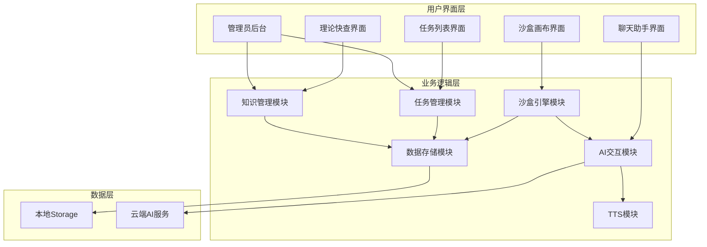
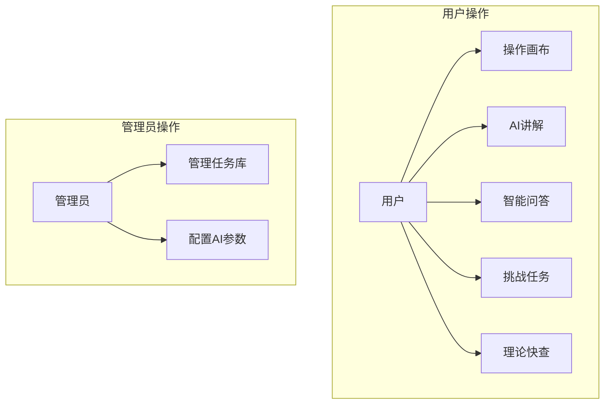
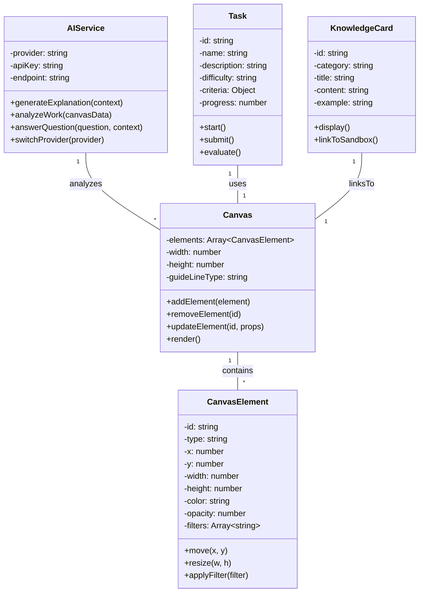
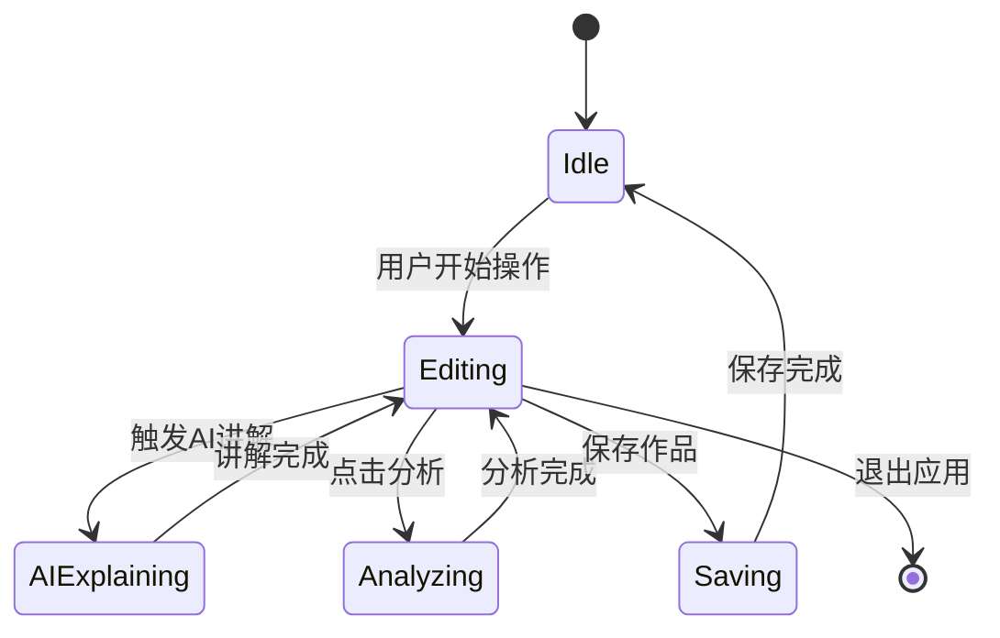
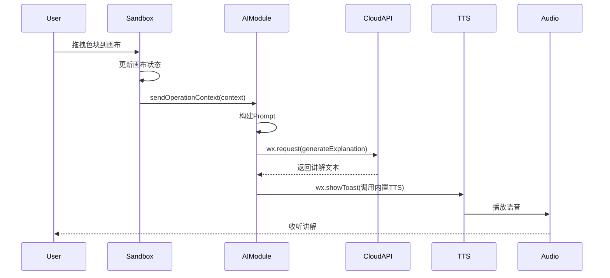
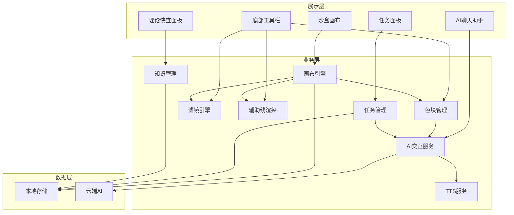
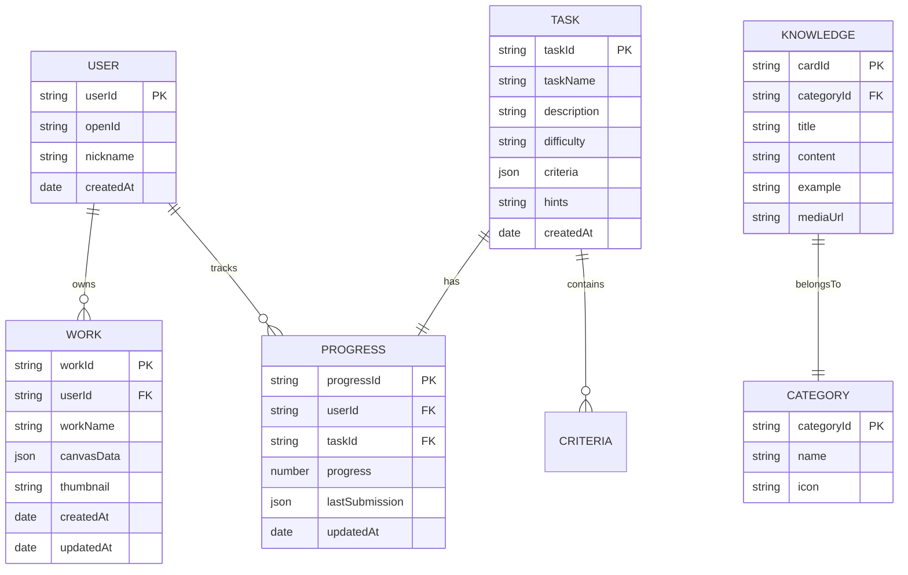

# AI全陪式色彩与构图交互学习工坊

## 软件详细设计报告 V2.0

***

### 项目信息

- **项目名称**：AI全陪式色彩与构图交互学习工坊
- **课程名称**：软件工程
- **学号**：2408090601018
- **班级**：数字媒体技术2401
- **报告编写日期**：2026年5月10日
- **版本**：V2.0
- **项目编号**：PRJ-2026-001
- **编写人**：谭玲霞

***

## 目录

1. [导言](#1-导言)
2. [系统设计概述](#2-系统设计概述)
3. [详细设计概述](#3-详细设计概述)
4. [详细设计](#4-详细设计)
   - 4.1 UML建模
   - 4.2 对象设计
   - 4.3 E-R图设计
   - 4.4 数据库设计
   - 4.5 创建存储过程
   - 4.6 网站结构与通用模块
5. [客户端模块设计](#5-客户端模块设计)
6. [管理员模块设计](#6-管理员模块设计)
7. [企业信息管理模块设计](#7-企业信息管理模块设计)
8. [搭建调试环境](#8-搭建调试环境)

***

## 1 导言

### 1.1 目的

本文档是"AI全陪式色彩与构图交互学习工坊"的软件详细设计报告，旨在根据需求分析报告和可行性分析报告，详细描述系统的实现方案，包括：

- 系统架构设计
- 数据库设计
- 界面设计
- 模块划分与接口设计
- 核心算法与程序逻辑

本文档为开发人员提供详细的实现指南，为测试人员提供测试依据。

### 1.2 范围

本报告涵盖以下内容：

- 系统整体架构设计
- 数据库模型设计
- 客户端模块详细设计
- 各个功能模块的程序描述
- 用户界面设计
- 网络通信设计
- 调试环境搭建方案

### 1.3 缩写说明

| 缩写   | 全称                                | 说明      |
| ---- | --------------------------------- | ------- |
| AI   | Artificial Intelligence           | 人工智能    |
| API  | Application Programming Interface | 应用程序接口  |
| TTS  | Text-to-Speech                    | 文本转语音   |
| LLM  | Large Language Model              | 大语言模型   |
| UI   | User Interface                    | 用户界面    |
| UX   | User Experience                   | 用户体验    |
| JSON | JavaScript Object Notation        | 数据交换格式  |
| UUID | Universally Unique Identifier     | 通用唯一标识符 |

### 1.4 引用标准

| 序号 | 标准名称        | 标准编号                  |
| -- | ----------- | --------------------- |
| 1  | 计算机软件文档编制规范 | GB/T 8567-2006        |
| 2  | 微信小程序官方开发规范 | 腾讯标准                  |
| 3  | p5.js开发规范   | Processing Foundation |

### 1.5 参考资料

| 序号 | 资料名称                             | 来源                                 |
| -- | -------------------------------- | ---------------------------------- |
| 1  | AI全陪式色彩与构图交互学习工坊需求分析报告\_V2.0.md  | 项目文档                               |
| 2  | AI全陪式色彩与构图交互学习工坊可行性分析报告\_V3.0.md | 项目文档                               |
| 3  | 微信小程序官方文档                        | <https://developers.weixin.qq.com> |
| 4  | p5.js参考手册                        | <https://p5js.org>                 |
| 5  | 百度千帆大模型平台文档                      | <https://cloud.baidu.com>          |

### 1.6 版本更新信息

| 版本   | 日期         | 更新内容                | 作者  |
| ---- | ---------- | ------------------- | --- |
| V1.0 | 2026-04-20 | 初始版本                | 谭玲霞 |
| V2.0 | 2026-05-10 | 完善数据库设计、界面设计、模块详细设计 | 谭玲霞 |

***

## 2 系统设计概述

### 2.1 概述

**AI全陪式色彩与构图交互学习工坊**是一款基于微信小程序的互动学习平台，旨在通过高互动性的视觉实验沙盒，帮助用户直观学习色彩理论与构图法则。系统集成云端AI智能体，提供"操作-讲解-反馈-问答"的全流程伴随式学习体验。

### 2.2 系统管理员对功能的需求

| 需求编号    | 需求描述     | 优先级 |
| ------- | -------- | --- |
| ADM-001 | 管理挑战任务库  | 中   |
| ADM-002 | 配置AI服务参数 | 中   |
| ADM-003 | 管理知识卡片内容 | 中   |
| ADM-004 | 查看系统使用统计 | 低   |
| ADM-005 | 管理用户反馈   | 低   |

### 2.3 普通用户对功能的需求

| 需求编号    | 需求描述     | 优先级 |
| ------- | -------- | --- |
| USR-001 | 互动实验沙盒操作 | 高   |
| USR-002 | AI智能讲解   | 高   |
| USR-003 | 智能问答助手   | 高   |
| USR-004 | 挑战任务     | 中   |
| USR-005 | 理论快查     | 中   |
| USR-006 | 作品保存与导出  | 中   |

### 2.4 系统架构图



***

## 3 详细设计概述

### 3.1 设计原则

1. **模块化设计**：各功能模块独立，便于维护和扩展
2. **高内聚低耦合**：模块内部紧密相关，模块间依赖最小化
3. **用户体验优先**：简洁直观的界面设计，流畅的交互体验
4. **可扩展性**：支持功能扩展和AI服务切换
5. **稳定性**：确保核心功能离线可用，异常情况友好处理

### 3.2 技术选型

| 分类   | 技术             | 版本   | 说明         |
| ---- | -------------- | ---- | ---------- |
| 前端框架 | 微信小程序          | 8.0+ | 即点即用，跨平台支持 |
| 图形引擎 | p5.js          | 1.0+ | 创意编程，画布绘制  |
| AI服务 | 百度千帆/阿里通义/腾讯混元 | -    | 云端大语言模型API |
| TTS  | 微信内置TTS        | -    | 文本转语音      |
| 数据存储 | 微信小程序本地Storage | -    | 本地数据持久化    |

### 3.3 关键设计约束

| 约束类型 | 约束内容                          |
| ---- | ----------------------------- |
| 响应时间 | 画布操作≤100ms，AI响应≤3秒，TTS合成≤1秒   |
| 内存占用 | 运行时≤100MB                     |
| 网络要求 | AI功能需稳定网络，核心功能离线可用            |
| 兼容性  | 微信8.0+，iOS 12.0+/Android 8.0+ |

***

## 4 详细设计

### 4.1 UML建模

#### 4.1.1 用例图



#### 4.1.2 类图



> **AI使用标注**：UML类图设计由元宝生成初稿，经手动调整类结构和方法定义。关键提示词："为一个AI色彩构图学习小程序设计UML类图，包含画布、画布元素、AI服务、任务、知识卡片5个核心类，用mermaid语法"。修改率：约30%（AI生成的核心类和关系保留，补充了属性和方法的具体定义，调整了类之间的关联关系）。

#### 4.1.3 状态图



#### 4.1.4 时序图

**AI讲解触发流程：**



#### 4.1.5 架构图



### 4.2 对象设计

#### 4.2.1 画布元素对象

| 属性名      | 类型     | 说明                            | 默认值          |
| -------- | ------ | ----------------------------- | ------------ |
| id       | string | 元素唯一标识(UUID)                  | -            |
| type     | string | 元素类型(color\_block/shape/text) | color\_block |
| x        | number | X坐标                           | 0            |
| y        | number | Y坐标                           | 0            |
| width    | number | 宽度                            | 100          |
| height   | number | 高度                            | 100          |
| color    | string | 颜色值(#RRGGBB)                  | #2196F3      |
| opacity  | number | 不透明度(0-1)                     | 1            |
| filters  | array  | 应用的滤镜列表                       | \[]          |
| rotation | number | 旋转角度(度)                       | 0            |

#### 4.2.2 用户作品对象

| 属性名        | 类型     | 说明          | 默认值   |
| ---------- | ------ | ----------- | ----- |
| workId     | string | 作品唯一标识      | -     |
| userId     | string | 用户标识        | -     |
| workName   | string | 作品名称        | 未命名作品 |
| canvasData | object | 画布元素数据      | {}    |
| thumbnail  | string | 缩略图(Base64) | -     |
| createTime | string | 创建时间        | 当前时间戳 |
| updateTime | string | 更新时间        | 当前时间戳 |

#### 4.2.3 挑战任务对象

| 属性名         | 类型     | 说明                     | 默认值    |
| ----------- | ------ | ---------------------- | ------ |
| taskId      | string | 任务唯一标识                 | -      |
| taskName    | string | 任务名称                   | -      |
| description | string | 任务描述                   | -      |
| difficulty  | string | 难度等级(easy/medium/hard) | medium |
| criteria    | object | 评分标准                   | {}     |
| hints       | array  | 提示信息                   | \[]    |

#### 4.2.4 AI交互上下文对象

| 属性名           | 类型     | 说明                                 |
| ------------- | ------ | ---------------------------------- |
| operationType | string | 操作类型(drag/resize/filter/guideLine) |
| elementInfo   | object | 操作元素信息                             |
| canvasState   | object | 当前画布状态摘要                           |
| history       | array  | 最近操作历史                             |
| userQuestion  | string | 用户问题(问答场景)                         |

### 4.3 E-R图设计



### 4.4 数据库设计

#### 4.4.1 表结构设计

**用户表 (users)**

| 字段名         | 类型           | 约束          | 说明           |
| ----------- | ------------ | ----------- | ------------ |
| user\_id    | VARCHAR(36)  | PRIMARY KEY | 用户唯一标识(UUID) |
| open\_id    | VARCHAR(64)  | UNIQUE      | 微信OpenID(可选) |
| nickname    | VARCHAR(100) | -           | 用户昵称         |
| preferences | JSON         | -           | 用户偏好设置       |
| created\_at | DATETIME     | NOT NULL    | 创建时间         |
| updated\_at | DATETIME     | -           | 更新时间         |

**作品表 (works)**

| 字段名          | 类型           | 约束          | 说明         |
| ------------ | ------------ | ----------- | ---------- |
| work\_id     | VARCHAR(36)  | PRIMARY KEY | 作品唯一标识     |
| user\_id     | VARCHAR(36)  | FOREIGN KEY | 所属用户       |
| work\_name   | VARCHAR(100) | -           | 作品名称       |
| canvas\_data | JSON         | NOT NULL    | 画布数据(JSON) |
| thumbnail    | TEXT         | -           | 缩略图Base64  |
| created\_at  | DATETIME     | NOT NULL    | 创建时间       |
| updated\_at  | DATETIME     | -           | 更新时间       |

**任务表 (tasks)**

| 字段名         | 类型           | 约束          | 说明     |
| ----------- | ------------ | ----------- | ------ |
| task\_id    | VARCHAR(36)  | PRIMARY KEY | 任务唯一标识 |
| task\_name  | VARCHAR(100) | NOT NULL    | 任务名称   |
| description | TEXT         | NOT NULL    | 任务描述   |
| difficulty  | VARCHAR(20)  | NOT NULL    | 难度等级   |
| criteria    | JSON         | NOT NULL    | 评分标准   |
| hints       | JSON         | -           | 提示信息列表 |
| created\_at | DATETIME     | NOT NULL    | 创建时间   |

**进度表 (progress)**

| 字段名              | 类型          | 约束            | 说明          |
| ---------------- | ----------- | ------------- | ----------- |
| progress\_id     | VARCHAR(36) | PRIMARY KEY   | 进度唯一标识      |
| user\_id         | VARCHAR(36) | FOREIGN KEY   | 用户标识        |
| task\_id         | VARCHAR(36) | FOREIGN KEY   | 任务标识        |
| progress         | INT         | NOT NULL      | 完成进度(0-100) |
| last\_score      | FLOAT       | -             | 上次评分        |
| last\_submission | JSON        | -             | 上次提交内容      |
| completed        | BOOLEAN     | DEFAULT FALSE | 是否完成        |
| updated\_at      | DATETIME    | NOT NULL      | 更新时间        |

**知识卡片表 (knowledge)**

| 字段名          | 类型           | 约束          | 说明      |
| ------------ | ------------ | ----------- | ------- |
| card\_id     | VARCHAR(36)  | PRIMARY KEY | 卡片唯一标识  |
| category\_id | VARCHAR(36)  | FOREIGN KEY | 分类标识    |
| title        | VARCHAR(100) | NOT NULL    | 卡片标题    |
| content      | TEXT         | NOT NULL    | 卡片内容    |
| example      | JSON         | -           | 示例数据    |
| media\_url   | VARCHAR(255) | -           | 媒体资源URL |
| sort\_order  | INT          | DEFAULT 0   | 排序序号    |

**分类表 (categories)**

| 字段名          | 类型           | 约束          | 说明     |
| ------------ | ------------ | ----------- | ------ |
| category\_id | VARCHAR(36)  | PRIMARY KEY | 分类唯一标识 |
| name         | VARCHAR(50)  | NOT NULL    | 分类名称   |
| icon         | VARCHAR(100) | -           | 图标名称   |
| description  | VARCHAR(200) | -           | 分类描述   |

**聊天记录表 (chat\_history)**

| 字段名         | 类型          | 约束          | 说明                 |
| ----------- | ----------- | ----------- | ------------------ |
| message\_id | VARCHAR(36) | PRIMARY KEY | 消息唯一标识             |
| session\_id | VARCHAR(36) | NOT NULL    | 会话标识               |
| user\_id    | VARCHAR(36) | FOREIGN KEY | 用户标识               |
| role        | VARCHAR(10) | NOT NULL    | 角色(user/assistant) |
| content     | TEXT        | NOT NULL    | 消息内容               |
| context     | JSON        | -           | 上下文信息              |
| timestamp   | DATETIME    | NOT NULL    | 时间戳                |

#### 4.4.2 索引设计

| 表名            | 索引名                       | 字段                 | 类型     |
| ------------- | ------------------------- | ------------------ | ------ |
| users         | idx\_users\_open\_id      | open\_id           | UNIQUE |
| works         | idx\_works\_user\_id      | user\_id           | NORMAL |
| works         | idx\_works\_created\_at   | created\_at        | NORMAL |
| tasks         | idx\_tasks\_difficulty    | difficulty         | NORMAL |
| progress      | idx\_progress\_user\_task | user\_id, task\_id | UNIQUE |
| progress      | idx\_progress\_user\_id   | user\_id           | NORMAL |
| knowledge     | idx\_knowledge\_category  | category\_id       | NORMAL |
| chat\_history | idx\_chat\_session        | session\_id        | NORMAL |
| chat\_history | idx\_chat\_timestamp      | timestamp          | NORMAL |

> **AI使用标注**：数据库表结构设计由GitHub Copilot辅助生成，经手动调整字段和约束。关键提示词："为一个AI色彩构图学习小程序设计7张数据库表：用户表、作品表、任务表、进度表、知识卡片表、分类表、聊天记录表，包含完整字段、类型和约束"。修改率：约35%（AI生成的表结构框架保留，补充了项目特有的字段如缩略图、评分标准、排序序号等，调整了主键外键关系）。

### 4.5 创建存储过程

#### 4.5.1 获取用户作品列表

```sql
CREATE PROCEDURE GetUserWorks(IN p_user_id VARCHAR(36))
BEGIN
    SELECT 
        work_id,
        work_name,
        thumbnail,
        created_at,
        updated_at
    FROM works
    WHERE user_id = p_user_id
    ORDER BY created_at DESC;
END
```

#### 4.5.2 获取用户任务进度

```sql
CREATE PROCEDURE GetUserProgress(IN p_user_id VARCHAR(36))
BEGIN
    SELECT 
        p.progress_id,
        p.task_id,
        t.task_name,
        t.difficulty,
        p.progress,
        p.last_score,
        p.completed,
        p.updated_at
    FROM progress p
    JOIN tasks t ON p.task_id = t.task_id
    WHERE p.user_id = p_user_id
    ORDER BY t.difficulty, p.updated_at;
END
```

#### 4.5.3 更新任务进度

```sql
CREATE PROCEDURE UpdateTaskProgress(
    IN p_user_id VARCHAR(36),
    IN p_task_id VARCHAR(36),
    IN p_progress INT,
    IN p_score FLOAT,
    IN p_submission JSON
)
BEGIN
    DECLARE existing_id VARCHAR(36);
    
    SELECT progress_id INTO existing_id
    FROM progress
    WHERE user_id = p_user_id AND task_id = p_task_id;
    
    IF existing_id IS NOT NULL THEN
        UPDATE progress SET
            progress = p_progress,
            last_score = p_score,
            last_submission = p_submission,
            completed = CASE WHEN p_progress >= 100 THEN TRUE ELSE FALSE END,
            updated_at = NOW()
        WHERE progress_id = existing_id;
    ELSE
        INSERT INTO progress (
            progress_id,
            user_id,
            task_id,
            progress,
            last_score,
            last_submission,
            completed,
            updated_at
        ) VALUES (
            UUID(),
            p_user_id,
            p_task_id,
            p_progress,
            p_score,
            p_submission,
            CASE WHEN p_progress >= 100 THEN TRUE ELSE FALSE END,
            NOW()
        );
    END IF;
END
```

#### 4.5.4 获取知识卡片分类

```sql
CREATE PROCEDURE GetKnowledgeByCategory(IN p_category_id VARCHAR(36))
BEGIN
    SELECT 
        card_id,
        title,
        content,
        example,
        media_url,
        sort_order
    FROM knowledge
    WHERE category_id = p_category_id
    ORDER BY sort_order ASC;
END
```

> **AI使用标注**：SQL存储过程由GitHub Copilot生成初稿，经手动调整参数和业务逻辑。关键提示词："为上述数据库表设计4个常用存储过程：获取用户作品列表、获取用户任务进度、更新任务进度、获取知识卡片分类，用MySQL语法"。修改率：约25%（AI生成的存储过程结构保留，调整了字段名和返回值格式，补充了UPSERT逻辑以适配小程序本地存储场景）。

### 4.6 网站结构与通用模块

#### 4.6.1 网站结构

```
微信小程序根目录
├── app.js                 # 小程序入口
├── app.json               # 全局配置
├── app.wxss               # 全局样式
├── pages/                 # 页面目录
│   ├── index/             # 首页
│   │   ├── index.wxml
│   │   ├── index.wxss
│   │   └── index.js
│   ├── sandbox/           # 沙盒画布页
│   │   ├── sandbox.wxml
│   │   ├── sandbox.wxss
│   │   └── sandbox.js
│   ├── tasks/             # 任务列表页
│   │   ├── tasks.wxml
│   │   ├── tasks.wxss
│   │   └── tasks.js
│   ├── task-detail/       # 任务详情页
│   │   ├── task-detail.wxml
│   │   ├── task-detail.wxss
│   │   └── task-detail.js
│   ├── knowledge/         # 理论快查页
│   │   ├── knowledge.wxml
│   │   ├── knowledge.wxss
│   │   └── knowledge.js
│   ├── profile/           # 个人中心页
│   │   ├── profile.wxml
│   │   ├── profile.wxss
│   │   └── profile.js
│   └── admin/             # 管理员后台
│       ├── admin.wxml
│       ├── admin.wxss
│       └── admin.js
├── components/            # 组件目录
│   ├── color-picker/      # 调色板组件
│   ├── chat-assistant/    # 聊天助手组件
│   ├── tool-bar/          # 工具栏组件
│   └── guide-lines/       # 辅助线组件
├── utils/                 # 工具函数
│   ├── ai-service.js      # AI服务封装
│   ├── storage.js         # 本地存储工具
│   ├── canvas-engine.js   # 画布引擎
│   └── tts-service.js     # TTS服务
└── data/                  # 静态数据
    ├── tasks.json         # 初始任务数据
    └── knowledge.json     # 初始知识卡片
```

#### 4.6.2 通用模块

##### 4.6.2.1 AI服务模块

**功能**：封装云端AI API调用，支持多服务商切换

**输入**：

- prompt: string - 提示词文本
- context: object - 上下文信息
- provider: string - AI服务商标识

**输出**：

- response: object - AI响应结果
  - text: string - 生成的文本内容
  - success: boolean - 是否成功
  - error: string - 错误信息(失败时)

**接口方法**：

| 方法名                 | 功能说明   | 参数                                | 返回值              |
| ------------------- | ------ | --------------------------------- | ---------------- |
| generateExplanation | 生成操作讲解 | context: object                   | Promise\<string> |
| analyzeWork         | 分析作品   | canvasData: object                | Promise\<object> |
| answerQuestion      | 回答问题   | question: string, context: object | Promise\<string> |
| switchProvider      | 切换服务商  | provider: string                  | void             |

##### 4.6.2.2 存储服务模块

**功能**：封装本地Storage操作，提供统一的数据存取接口

**接口方法**：

| 方法名            | 功能说明     | 参数                             | 返回值         |
| -------------- | -------- | ------------------------------ | ----------- |
| saveWork       | 保存作品     | work: object                   | boolean     |
| getWork        | 获取作品     | workId: string                 | object/null |
| getUserWorks   | 获取用户作品列表 | userId: string                 | array       |
| deleteWork     | 删除作品     | workId: string                 | boolean     |
| saveProgress   | 保存进度     | progress: object               | boolean     |
| getProgress    | 获取进度     | userId: string, taskId: string | object/null |
| saveChat       | 保存聊天记录   | message: object                | boolean     |
| getChatHistory | 获取聊天记录   | sessionId: string              | array       |
| clearAllData   | 清空所有数据   | -                              | boolean     |

##### 4.6.2.3 TTS服务模块

**功能**：封装微信内置TTS接口，提供语音播放控制

**接口方法**：

| 方法名       | 功能说明     | 参数           | 返回值     |
| --------- | -------- | ------------ | ------- |
| speak     | 播放语音     | text: string | void    |
| stop      | 停止播放     | -            | void    |
| pause     | 暂停播放     | -            | void    |
| resume    | 继续播放     | -            | void    |
| isPlaying | 检查是否正在播放 | -            | boolean |

##### 4.6.2.4 画布引擎模块

**功能**：基于p5.js实现画布绘制和元素管理

**接口方法**：

| 方法名            | 功能说明   | 参数                                               | 返回值               |
| -------------- | ------ | ------------------------------------------------ | ----------------- |
| init           | 初始化画布  | container: string, width: number, height: number | void              |
| addElement     | 添加元素   | element: object                                  | string(elementId) |
| removeElement  | 删除元素   | elementId: string                                | boolean           |
| updateElement  | 更新元素   | elementId: string, props: object                 | boolean           |
| getElement     | 获取元素   | elementId: string                                | object/null       |
| getAllElements | 获取所有元素 | -                                                | array             |
| setGuideLine   | 设置辅助线  | type: string                                     | void              |
| clearGuideLine | 清除辅助线  | -                                                | void              |
| applyFilter    | 应用滤镜   | elementId: string, filter: string                | boolean           |
| exportImage    | 导出图片   | format: string                                   | string(base64)    |
| clearCanvas    | 清空画布   | -                                                | void              |

> **AI使用标注**：通用模块接口设计由ChatGPT生成初稿，经手动补充方法和调整参数。关键提示词："为微信小程序AI色彩学习项目设计4个核心服务模块的接口：AI服务、存储服务、TTS服务、画布引擎，每个模块列出主要方法和参数"。修改率：约30%（AI生成的模块划分和核心方法保留，补充了导出图片、切换服务商等项目特有方法，调整了参数类型以适配小程序API）。

***

## 5 客户端模块设计

### 5.1 表示层设计

#### 5.1.1 页面布局设计

**首页布局**：

```
┌──────────────────────────────────────────────────────┐
│                    顶部导航栏                         │
│  ┌──────┐   AI全陪式色彩与构图交互学习工坊   ┌──────┐ │
│  │ 返回 │                                    │ 菜单 │ │
│  └──────┘                                    └──────┘ │
├──────────────────────────────────────────────────────┤
│                                                      │
│  ┌────────────────────────────────────────────────┐  │
│  │              欢迎区域（Logo + 简介）            │  │
│  └────────────────────────────────────────────────┘  │
│                                                      │
│  ┌─────────────┐  ┌─────────────┐  ┌─────────────┐   │
│  │   开始创作  │  │   挑战任务  │  │   理论快查  │   │
│  │    [图标]   │  │    [图标]   │  │    [图标]   │   │
│  └─────────────┘  └─────────────┘  └─────────────┘   │
│                                                      │
│  ┌────────────────────────────────────────────────┐  │
│  │              最近作品展示                       │  │
│  └────────────────────────────────────────────────┘  │
└──────────────────────────────────────────────────────┘
```

**沙盒画布页布局**：

```
┌──────────────────────────────────────────────────────┐
│                    顶部导航栏                         │
│  ┌──────┐   互动实验沙盒              ┌──────────┐   │
│  │ 返回 │                            │ 保存/导出 │   │
│  └──────┘                            └──────────┘   │
├──────────────────────────────────────────────────────┤
│                                                      │
│                    画布区域                          │
│  ┌──────────────────────────────────────────────┐    │
│  │                                              │    │
│  │         主画布（可拖拽色块、应用滤镜）          │    │
│  │                                              │    │
│  │  [构图辅助线开关]  [显示网格]  [重置画布]       │    │
│  └──────────────────────────────────────────────┘    │
│                                                      │
├──────────────────────────────────────────────────────┤
│  ┌──────┐ ┌──────┐ ┌──────┐ ┌──────┐ ┌──────┐      │
│  │调色板│ │形状库│ │滤镜  │ │分析  │ │问答  │      │
│  └──────┘ └──────┘ └──────┘ └──────┘ └──────┘      │
├──────────────────────────────────────────────────────┤
│              AI聊天助手（可展开/收起）                 │
└──────────────────────────────────────────────────────┘
```

#### 5.1.2 色彩方案

| 元素   | 颜色值     | 说明            |
| ---- | ------- | ------------- |
| 主色调  | #2196F3 | 导航栏、主要按钮、强调元素 |
| 辅助色  | #4CAF50 | 成功状态、完成按钮     |
| 警告色  | #FF9800 | 警告提示、待处理状态    |
| 错误色  | #F44336 | 错误提示、失败状态     |
| 背景色  | #F5F5F5 | 页面背景          |
| 画布背景 | #FFFFFF | 沙盒画布默认背景      |
| 文字色  | #212121 | 正文文字          |
| 辅助文字 | #757575 | 次要文字、提示文字     |

#### 5.1.3 交互设计

| 交互场景  | 设计说明                    |
| ----- | ----------------------- |
| 色块拖拽  | 支持长按选中、拖拽移动、双指缩放旋转      |
| 操作反馈  | 操作时显示半透明遮罩提示，AI讲解自动播放   |
| 撤销/重做 | 支持手势滑动撤销、按钮点击撤销         |
| 辅助线切换 | 底部工具栏按钮切换，实时预览效果        |
| 聊天助手  | 侧边栏设计，支持展开/收起动画         |
| 语音控制  | 播放/暂停按钮，语速调节（0.8x-1.5x） |

### 5.2 控制层

#### 5.2.1 页面路由配置

| 页面路径               | 页面名称  | 功能说明      |
| ------------------ | ----- | --------- |
| /pages/index       | 首页    | 应用入口、功能导航 |
| /pages/sandbox     | 沙盒画布页 | 核心创作区域    |
| /pages/tasks       | 任务列表页 | 挑战任务列表    |
| /pages/task-detail | 任务详情页 | 任务详情与提交   |
| /pages/knowledge   | 理论快查页 | 知识卡片浏览    |
| /pages/profile     | 个人中心页 | 用户信息与设置   |
| /pages/admin       | 管理员后台 | 任务管理与配置   |

#### 5.2.2 状态管理

**全局状态**：

```javascript
{
  user: {
    userId: string,
    nickname: string,
    preferences: {
      theme: string,
      ttsEnabled: boolean,
      ttsSpeed: number
    }
  },
  currentWork: {
    workId: string,
    workName: string,
    canvasData: object
  },
  aiStatus: {
    isLoading: boolean,
    currentProvider: string,
    usage: number
  },
  navigation: {
    currentPage: string,
    history: array
  }
}
```

#### 5.2.3 事件处理

| 事件类型   | 处理逻辑            |
| ------ | --------------- |
| 色块拖拽开始 | 记录起始位置，显示选中状态   |
| 色块拖拽移动 | 实时更新位置，触发AI讲解判断 |
| 色块拖拽结束 | 保存操作历史，触发AI讲解   |
| 滤镜应用   | 应用滤镜效果，记录操作历史   |
| 辅助线切换  | 更新画布显示，保存用户偏好   |
| AI讲解触发 | 构建上下文，调用AI服务    |
| 分析按钮点击 | 收集画布状态，生成分析报告   |
| 问答输入   | 收集上下文，调用AI问答    |
| 任务提交   | 保存作品，调用AI评分     |

***

## 6 管理员模块设计

### 6.1 功能设计

| 功能模块 | 功能说明          | 权限要求 |
| ---- | ------------- | ---- |
| 任务管理 | 添加、编辑、删除挑战任务  | 管理员  |
| 知识管理 | 添加、编辑、删除知识卡片  | 管理员  |
| AI配置 | 配置AI服务商、API参数 | 管理员  |
| 数据统计 | 查看系统使用统计      | 管理员  |
| 用户管理 | 查看用户反馈、管理用户数据 | 管理员  |

### 6.2 界面设计

**管理员后台布局**：

```
┌──────────────────────────────────────────────────────┐
│                    顶部导航栏                         │
│              AI全陪式色彩与构图交互学习工坊            │
│                        [退出]                         │
├──────────────────────────────────────────────────────┤
│  ┌─────────────┐  ┌───────────────────────────────┐  │
│  │    菜单     │  │           内容区域              │  │
│  │ ──────────  │  │                               │  │
│  │ • 任务管理  │  │                               │  │
│  │ • 知识管理  │  │                               │  │
│  │ • AI配置    │  │                               │  │
│  │ • 数据统计  │  │                               │  │
│  │ • 用户管理  │  │                               │  │
│  └─────────────┘  └───────────────────────────────┘  │
└──────────────────────────────────────────────────────┘
```

### 6.3 接口设计

| 接口路径                 | 方法     | 功能     | 参数         | 返回值          |
| -------------------- | ------ | ------ | ---------- | ------------ |
| /admin/tasks         | GET    | 获取任务列表 | page, size | tasks, total |
| /admin/tasks         | POST   | 创建任务   | task对象     | taskId       |
| /admin/tasks/:id     | PUT    | 更新任务   | task对象     | success      |
| /admin/tasks/:id     | DELETE | 删除任务   | taskId     | success      |
| /admin/knowledge     | GET    | 获取知识卡片 | categoryId | cards        |
| /admin/knowledge     | POST   | 创建知识卡片 | card对象     | cardId       |
| /admin/knowledge/:id | PUT    | 更新知识卡片 | card对象     | success      |
| /admin/knowledge/:id | DELETE | 删除知识卡片 | cardId     | success      |
| /admin/config        | GET    | 获取AI配置 | -          | config       |
| /admin/config        | PUT    | 更新AI配置 | config对象   | success      |
| /admin/stats         | GET    | 获取统计数据 | -          | stats        |

***

## 7 企业信息管理模块设计

### 7.1 功能设计

| 功能模块   | 功能说明        | 说明     |
| ------ | ----------- | ------ |
| 企业信息展示 | 展示企业/项目基本信息 | 关于我们页面 |
| 使用条款   | 展示服务使用条款    | 用户协议   |
| 隐私政策   | 展示隐私保护政策    | 数据保护说明 |
| 帮助中心   | 常见问题解答      | FAQ页面  |
| 联系我们   | 联系方式与反馈渠道   | 反馈表单   |

### 7.2 界面设计

**关于页面布局**：

```
┌──────────────────────────────────────────────────────┐
│                    顶部导航栏                         │
│  ┌──────┐              关于我们               ┌──────┐│
│  │ 返回 │                                    │ 菜单 ││
│  └──────┘                                    └──────┘│
├──────────────────────────────────────────────────────┤
│                                                      │
│  ┌──────────────────────────────────────────────┐    │
│  │              Logo与项目介绍                   │    │
│  └──────────────────────────────────────────────┘    │
│                                                      │
│  ┌──────────────────────────────────────────────┐    │
│  │              功能特点介绍                     │    │
│  │  • AI智能讲解                               │    │
│  │  • 互动实验沙盒                             │    │
│  │  • 挑战任务系统                             │    │
│  │  • 理论知识快查                             │    │
│  └──────────────────────────────────────────────┘    │
│                                                      │
│  ┌──────────────────────────────────────────────┐    │
│  │              技术支持信息                     │    │
│  └──────────────────────────────────────────────┘    │
└──────────────────────────────────────────────────────┘
```

***

## 8 搭建调试环境

### 8.1 开发环境要求

| 环境      | 要求                       | 说明       |
| ------- | ------------------------ | -------- |
| 操作系统    | Windows 10+/macOS 10.15+ | 开发主机     |
| 微信开发者工具 | 最新版本                     | 小程序开发IDE |
| Node.js | 16.0+                    | 依赖管理     |
| 网络      | 稳定连接                     | 访问云端AI服务 |

### 8.2 环境搭建步骤

#### 8.2.1 安装微信开发者工具

1. 下载地址：<https://developers.weixin.qq.com/miniprogram/dev/devtools/download.html>
2. 安装并启动开发者工具
3. 注册微信小程序账号（个人开发者）

#### 8.2.2 创建小程序项目

1. 打开微信开发者工具
2. 点击"新建项目"
3. 选择"小程序"类型
4. 输入项目名称和目录
5. 选择"不使用云服务"
6. 点击"确定"创建项目

#### 8.2.3 配置AI服务

1. 注册百度千帆/阿里通义千问/腾讯混元账号
2. 创建应用并获取API Key
3. 在小程序后台配置服务器域名白名单
4. 在代码中配置API Key（建议通过环境变量）

#### 8.2.4 项目结构配置

```
miniprogram/
├── app.js              # 小程序入口
├── app.json            # 页面路由配置
├── app.wxss            # 全局样式
├── pages/              # 页面目录
├── components/         # 自定义组件
├── utils/              # 工具函数
└── data/               # 静态数据
```

### 8.3 调试工具使用

| 工具        | 功能      | 使用场景  |
| --------- | ------- | ----- |
| 模拟器       | 模拟小程序运行 | 界面调试  |
| 真机调试      | 真机运行调试  | 真机测试  |
| 网络面板      | 查看网络请求  | API调试 |
| Storage面板 | 查看本地存储  | 数据调试  |
| Console面板 | 输出日志信息  | 代码调试  |

### 8.4 测试用例设计

#### 8.4.1 功能测试用例

| 测试用例   | 测试步骤           | 预期结果       |
| ------ | -------------- | ---------- |
| 色块拖拽   | 从调色板选择颜色，拖拽到画布 | 色块成功添加并可移动 |
| AI讲解触发 | 拖拽色块到三分线交叉点    | 自动触发语音讲解   |
| 作品分析   | 完成创作后点击分析按钮    | 显示结构化分析报告  |
| 智能问答   | 在聊天框输入问题       | AI给出针对性回答  |
| 任务提交   | 完成任务并提交        | AI评分并显示评价  |
| 理论快查   | 浏览知识卡片         | 卡片内容正确显示   |

#### 8.4.2 性能测试用例

| 测试项     | 预期指标   | 测试方法    |
| ------- | ------ | ------- |
| 画布响应时间  | ≤100ms | 操作计时    |
| AI响应时间  | ≤3秒    | API调用计时 |
| TTS合成时间 | ≤1秒    | TTS接口计时 |
| 应用启动时间  | ≤3秒    | 冷启动计时   |
| 内存占用    | ≤100MB | 性能监控    |

> **AI使用标注**：测试用例设计由CodeBuddy建议生成，经手动筛选和补充测试场景。关键提示词："为一个AI色彩构图学习小程序设计功能测试和性能测试用例，各列出5-6项，用表格形式展示测试步骤和预期结果"。修改率：约25%（AI生成的测试框架保留，调整了测试场景使其更贴合项目实际功能，补充了AI相关的测试项）。

***

## 附录

### 附录A：核心算法说明

#### A.1 色块吸附对齐算法

```
输入：元素当前位置(x, y)，画布网格尺寸(gridSize)
输出：吸附后的位置(snappedX, snappedY)

算法步骤：
1. 计算距离最近的网格线坐标
2. 如果距离小于阈值(threshold)，则吸附到网格线
3. 否则保持原位置

公式：
snappedX = round(x / gridSize) * gridSize
snappedY = round(y / gridSize) * gridSize
```

#### A.2 色彩关系识别算法

```
输入：两个颜色值(color1, color2)
输出：色彩关系类型(string)

算法步骤：
1. 将颜色转换为HSB色彩空间
2. 计算色相差值(hueDiff = |h1 - h2|)
3. 根据色相差值判断色彩关系：
   - 类似色：hueDiff ≤ 30°
   - 互补色：150° ≤ hueDiff ≤ 210°
   - 三色组：hueDiff ≈ 120° 或 240°
   - 分裂互补：互补色两侧15°范围
```

#### A.3 AI提示词生成算法

```
输入：操作类型(operationType)，上下文(context)
输出：结构化提示词(string)

算法结构：
1. 角色设定："你是一位专业的色彩与构图导师..."
2. 任务说明：根据用户操作生成讲解/分析/回答
3. 上下文信息：当前画布状态、用户操作历史
4. 输出格式要求：结构化、简洁、专业
5. 语言要求：中文、口语化、易于理解
```

### 附录B：接口列表

#### B.1 云端AI API接口

| 接口                | 方法   | 参数                           | 返回值                        |
| ----------------- | ---- | ---------------------------- | -------------------------- |
| /chat/completions | POST | messages, model, temperature | choices\[].message.content |

#### B.2 微信小程序API接口

| API               | 功能   | 文档链接                                                                                      |
| ----------------- | ---- | ----------------------------------------------------------------------------------------- |
| wx.request        | 网络请求 | <https://developers.weixin.qq.com/miniprogram/dev/api/network/request/wx.request.html>    |
| wx.setStorageSync | 本地存储 | <https://developers.weixin.qq.com/miniprogram/dev/api/storage/wx.setStorageSync.html>     |
| wx.getStorageSync | 获取存储 | <https://developers.weixin.qq.com/miniprogram/dev/api/storage/wx.getStorageSync.html>     |
| wx.showToast      | 提示框  | <https://developers.weixin.qq.com/miniprogram/dev/api/ui/interaction/wx.showToast.html>   |
| wx.showLoading    | 加载提示 | <https://developers.weixin.qq.com/miniprogram/dev/api/ui/interaction/wx.showLoading.html> |

***

## 文档结束标记

**【本文档完】**

***

> **文档信息**
>
> - 文件名称：AI全陪式色彩与构图交互学习工坊软件详细设计报告\_V2.0.md
> - 创建日期：2026年5月10日
> - 最后更新：2026年5月10日
> - 文档状态：正式发布
> - 课程名称：软件工程
> - 学号：2408090601018
> - 班级：数字媒体技术2401

