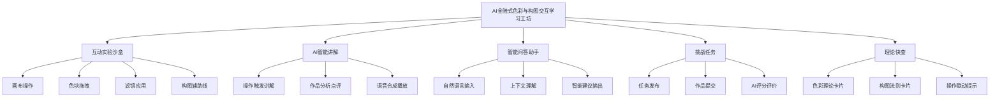
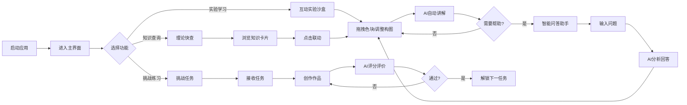
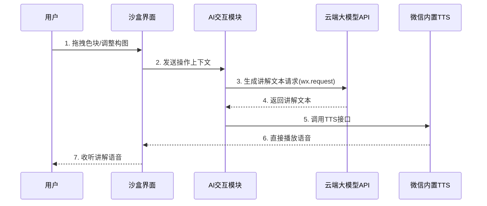
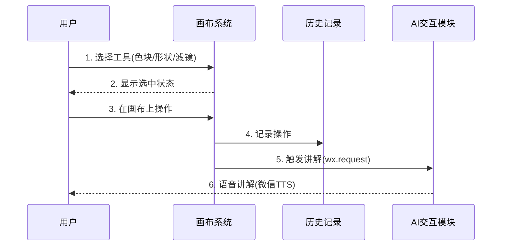
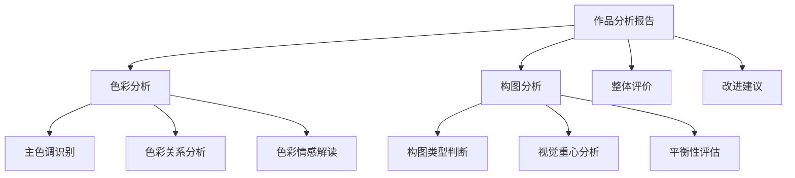
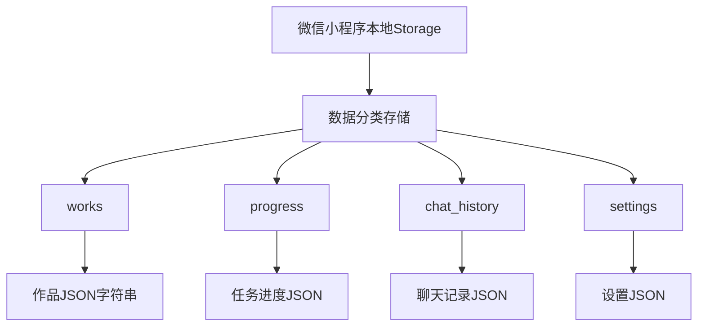
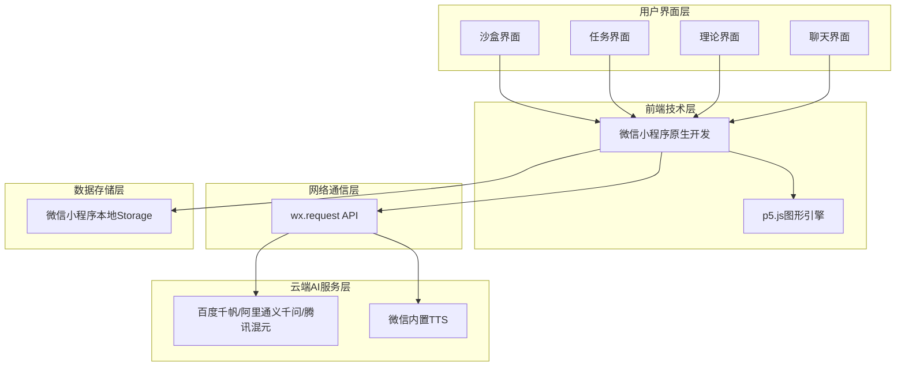

# 软件工程需求分析报告

---

## 前言

**项目信息**
- **项目名称**：AI全陪式色彩与构图交互学习工坊
- **课程名称**：软件工程
- **学号**：2408090601018
- **班级**：数字媒体技术2401
- **报告编写日期**：2026年4月30日
- **版本**：V2.0
- **编写人**：谭玲霞
- **项目编号**：PRJ-2026-001

---

## 目录

1. [引言](#1-引言)
2. [总体描述](#2-总体描述)
3. [具体需求](#3-具体需求)
4. [运行环境规定](#4-运行环境规定)
5. [其他需求](#5-其他需求)

***

# 1 引言

## 1.1 编写目的

本文档旨在完整地描述"AI全陪式色彩与构图交互学习工坊"系统的功能需求、性能需求、可靠性需求等，为开发团队提供明确的设计依据，为项目评审提供依据，为后续测试工作提供参考。本文档的预期读者包括：

- 项目开发人员：了解系统功能需求，指导系统设计与实现
- 项目评审人员：评估项目的可行性与完整性
- 测试人员：制定测试计划与测试用例
- 用户代表：确认需求是否符合预期

## 1.2 背景

- **系统名称**：AI全陪式色彩与构图交互学习工坊
- **项目来源**：课程设计项目
- **项目背景**：本项目旨在开发一个零成本、可在微信小程序中运行的轻量级应用。它通过高互动性的视觉实验沙盒，帮助用户直观学习色彩理论与构图法则，并创新性地集成国内云端AI服务（提供免费额度），提供实时语音讲解、答疑与智能反馈，打造一个高度个性化、如导师陪伴的智能学习环境。系统完全无需PC端支持，用户体验完整。
- **已知条件**：
  - 已有微信小程序开发框架
  - 已有成熟的图形引擎（p5.js小程序适配版）
  - 已有国内云端AI服务（百度千帆、阿里通义千问、腾讯混元，均提供免费额度）
  - 已有微信小程序内置TTS接口

## 1.3 定义

| 序号 | 术语      | 定义                             | 英文原文                 |
| -- | ------- | ------------------------------ | -------------------- |
| 1  | 沙盒      | 一种安全的实验环境，用户可在其中自由操作而不会产生实际风险   | Sandbox              |
| 2  | TTS     | 文本转语音技术，将文字信息转换为语音输出           | Text-to-Speech       |
| 3  | 云端AI API | 云端大语言模型接口服务，用户通过API调用远程AI能力   | Cloud AI API         |
| 4  | 互补色    | 色相环上相对位置的两种颜色，搭配使用可产生强烈对比效果    | Complementary Colors |
| 5  | 三分法     | 一种构图法则，将画面分为九等份，重要元素放置在交叉点上    | Rule of Thirds       |
| 6  | 黄金螺旋   | 基于黄金比例的构图辅助线，引导视觉流动            | Golden Spiral        |
| 7  | 微信小程序  | 一种不需要下载安装即可使用的轻量级应用，扫一扫或搜一搜即可打开 | Mini Program         |
| 8  | p5.js   | 一个用于创意编程的JavaScript库，基于Processing     | p5.js                |
| 9  | 百度千帆   | 百度推出的大模型平台，提供文心一言等模型API服务        | Wenxin Workshop      |
| 10 | 阿里通义千问 | 阿里巴巴推出的大模型平台，提供API服务             | Tongyi Qianwen       |
| 11 | 腾讯混元   | 腾讯推出的大模型平台，提供API服务               | Hunyuan              |

## 1.4 参考资料

| 序号 | 资料名称                       | 作者/来源                 | 日期/版本 |
| -- | -------------------------- | --------------------- | ----- |
| 1  | GB/T 8567-2006 计算机软件文档编制规范 | 国家标准化管理委员会            | 2006  |
| 2  | 微信小程序官方文档                 | 腾讯                   | 2024  |
| 3  | p5.js参考手册                   | Processing Foundation | 2024  |
| 4  | 百度千帆大模型平台文档              | 百度                   | 2024  |
| 5  | 阿里通义千问开发文档               | 阿里巴巴                | 2024  |
| 6  | 腾讯混元AI开发文档                | 腾讯                   | 2024  |
| 7  | 色彩设计原理                     | [日]伊达千代              | 2010  |
| 8  | 构图的艺术                      | [美]Ian Roberts       | 2016  |

***

# 2 总体描述

## 2.1 项目概述

### 2.1.1 系统简介

AI全陪式色彩与构图交互学习工坊是一款将色彩理论与基础构图法则深度融合的互动实验平台。系统集成云端AI智能体，提供"操作-讲解-反馈-问答"的全流程伴随式学习体验，从"工具"升级为"AI导师"。系统具有即点即用、零成本、完整AI体验三大核心优势，依托微信小程序生态，无需下载安装，扫码即用，所有AI能力通过云端API实现，无需本地配置。

### 2.1.2 主要功能清单

- **互动实验沙盒**：提供画布区，用户可自由拖拽色块、调整形状、应用滤镜，并选择构图辅助线
- **AI智能讲解**：用户操作时自动触发语音讲解，点击"分析"按钮可对当前作品进行结构化点评
- **智能问答助手**：侧边栏聊天界面，用户可随时输入自然语言问题，AI结合当前画布内容给出建议
- **挑战任务**：系统发布任务，用户完成创作后由AI进行评分与评价
- **理论快查**：结构化展示色彩关系、构图法则等知识卡片，与沙盒操作联动

> **AI使用标注**：核心功能需求清单由元宝生成初稿，经手动筛选和补充。关键提示词："为一个AI色彩与构图学习的微信小程序，设计5大核心功能模块，每个模块用一句话描述"。修改率：约30%（AI生成的功能框架保留，调整了模块名称和功能描述，补充了产品定位相关的细节）。

## 2.2 产品描述

### 2.2.1 系统功能架构



### 2.2.2 核心业务流程



### 2.2.3 AI讲解触发流程



## 2.3 用户特点

| 用户类型   | 描述                      | 数量估计 | 技术水平  |
| ------ | ----------------------- | ---- | ----- |
| 设计初学者  | 对色彩理论和构图法则有学习需求，但缺乏系统知识 | 大量   | 初级    |
| 艺术专业学生 | 需要通过实践巩固理论知识            | 中等   | 中级    |
| 自学爱好者  | 希望通过互动方式自学设计基础          | 中等   | 初级-中级 |
| 教学演示者  | 用于课堂演示色彩与构图原理           | 少量   | 中级-高级 |

## 2.4 约束

### 2.4.1 法规约束

- 系统需符合《个人信息保护法》对用户数据保护的要求
- 所有用户数据在微信小程序本地Storage存储，不上传至自建服务器
- AI调用通过官方API，遵守相应服务协议

### 2.4.2 硬件约束

- 客户端最低配置：微信版本8.0以上、手机系统iOS 12.0+/Android 8.0+
- 推荐配置：微信版本最新、手机系统iOS 14.0+/Android 10.0+
- 网络：稳定的移动数据或WiFi（用于AI功能）

### 2.4.3 技术约束

- 必须使用微信小程序框架开发
- 必须采用云端AI API（禁止本地AI模型）
- 核心沙盒功能支持离线使用，AI功能需要网络连接
- 开发周期为1个月（4个阶段）

### 2.4.4 时间约束

| 阶段   | 时间节点  | 主要目标              |
| ---- | ----- | --------------- |
| 第一阶段 | 第1周 | 基础交互沙盒原型、注册配置AI API |
| 第二阶段 | 第2周 | 集成AI讲解功能、智能问答、内置TTS语音 |
| 第三阶段 | 第3周 | 完成挑战任务、理论快查、Alpha测试版 |
| 第四阶段 | 第4周 | 打磨优化、测试修复、1.0正式版发布 |

***

# 3 具体需求

## 3.1 功能需求

### 3.1.1 互动实验沙盒模块

#### 3.1.1.1 画布操作功能

| 项目   | 内容                                 |
| ---- | ---------------------------------- |
| 功能描述 | 提供一个可自由操作的画布区域，用户可在画布上进行色彩与构图的实验操作 |
| 输入   | 鼠标/触控操作（点击、拖拽、缩放）                  |
| 处理   | 接收用户操作指令，更新画布显示内容，记录操作历史           |
| 输出   | 实时更新的画布视觉效果                        |
| 优先级  | 高                                  |

**业务流程：**



#### 3.1.1.2 色块拖拽功能

| 项目   | 内容                            |
| ---- | ----------------------------- |
| 功能描述 | 用户可从调色板中选择颜色，创建色块并自由拖拽到画布任意位置 |
| 输入   | 颜色选择、位置坐标、尺寸参数                |
| 处理   | 创建色块对象，更新位置属性，实时渲染            |
| 输出   | 画布上的色块显示                      |
| 优先级  | 高                             |

#### 3.1.1.3 滤镜应用功能

| 项目   | 内容                                   |
| ---- | ------------------------------------ |
| 功能描述 | 提供多种滤镜效果（模糊、锐化、灰度、反色等），用户可应用于画布或选中区域 |
| 输入   | 滤镜类型、应用范围、强度参数                       |
| 处理   | 根据滤镜算法处理图像数据                         |
| 输出   | 应用滤镜后的视觉效果                           |
| 优先级  | 中                                    |

#### 3.1.1.4 构图辅助线功能

| 项目   | 内容                                      |
| ---- | --------------------------------------- |
| 功能描述 | 提供多种构图辅助线（三分线、黄金螺旋、对角线、对称轴等），帮助用户理解构图法则 |
| 输入   | 辅助线类型选择、显示/隐藏切换                         |
| 处理   | 在画布上叠加绘制辅助线                             |
| 输出   | 带辅助线的画布显示                               |
| 优先级  | 高                                       |

**支持的构图辅助线类型：**

| 类型   | 说明                    |
| ---- | --------------------- |
| 三分线  | 将画布分为3×3网格，重要元素放置在交叉点 |
| 黄金螺旋 | 基于斐波那契数列的螺旋线，引导视觉流动   |
| 对角线  | 从角到角的对角线，增加动态感        |
| 对称轴  | 水平或垂直对称轴，用于对称构图       |
| 黄金分割 | 基于黄金比例的分割线            |

### 3.1.2 AI智能讲解模块

#### 3.1.2.1 操作触发讲解功能

| 项目   | 内容                                |
| ---- | --------------------------------- |
| 功能描述 | 当用户在沙盒中进行操作时，AI自动识别操作类型并生成相应的理论讲解 |
| 输入   | 用户操作上下文（操作类型、当前画布状态、历史操作）         |
| 处理   | AI模型分析操作，结合色彩/构图理论生成讲解文本，TTS转换为语音 |
| 输出   | 语音讲解内容                            |
| 优先级  | 高                                 |

**讲解触发规则：**

| 操作类型    | 触发讲解示例                                |
| ------- | ------------------------------------- |
| 放置互补色色块 | "您使用了互补色，这增强了画面的对比效果，使色彩更加鲜明。"        |
| 应用三分法构图 | "您将主体放置在三分线的交叉点上，这是经典的构图技巧，能让画面更加平衡。" |
| 调整色彩饱和度 | "降低饱和度可以营造柔和、宁静的氛围，常用于表现怀旧或梦幻效果。"     |

#### 3.1.2.2 作品分析点评功能

| 项目   | 内容                                  |
| ---- | ----------------------------------- |
| 功能描述 | 用户点击"分析"按钮后，AI对当前画布作品进行全面分析，给出结构化点评 |
| 输入   | 当前画布完整状态（色彩分布、构图结构、元素位置）            |
| 处理   | AI模型综合分析，从色彩搭配、构图平衡、视觉层次等维度生成评价     |
| 输出   | 结构化分析报告（文字+语音）                      |
| 优先级  | 高                                   |

**分析报告结构：**



### 3.1.3 智能问答助手模块

#### 3.1.3.1 自然语言问答功能

| 项目   | 内容                                    |
| ---- | ------------------------------------- |
| 功能描述 | 用户可在侧边栏聊天界面输入自然语言问题，AI结合当前画布内容给出针对性建议 |
| 输入   | 用户问题文本、当前画布状态上下文                      |
| 处理   | AI模型理解问题意图，结合上下文生成回答                  |
| 输出   | 文字回答（可选语音朗读）                          |
| 优先级  | 高                                     |

**典型问答场景：**

| 用户问题         | AI回答示例                                        |
| ------------ | --------------------------------------------- |
| "怎么让画面更平衡？"  | "您可以尝试将左侧的深色色块向中心移动，或在右侧添加一个相近大小的元素，以平衡视觉重量。" |
| "这个配色有什么问题？" | "当前画面使用了过多的暖色调，建议添加一些冷色调元素作为对比，增加画面的层次感。"     |
| "什么是类似色？"    | "类似色是指在色相环上相邻的颜色，如红-橙-黄。使用类似色可以营造和谐、统一的视觉效果。" |

### 3.1.4 挑战任务模块

#### 3.1.4.1 任务发布功能

| 项目   | 内容                         |
| ---- | -------------------------- |
| 功能描述 | 系统发布具有明确目标的创作任务，引导用户有目的地练习 |
| 输入   | 任务库、用户进度                   |
| 处理   | 根据用户进度选择合适难度的任务            |
| 输出   | 任务描述、目标要求、评分标准             |
| 优先级  | 中                          |

**任务示例：**

| 任务名称 | 任务描述              | 难度 |
| ---- | ----------------- | -- |
| 宁静氛围 | 使用类似色营造宁静、和谐的画面氛围 | 入门 |
| 强烈对比 | 使用互补色创造强烈的视觉对比效果  | 初级 |
| 黄金构图 | 运用黄金螺旋构图创作一幅作品    | 中级 |
| 情感表达 | 使用色彩表达"温暖"的情感主题   | 中级 |
| 综合创作 | 综合运用色彩与构图法则完成主题创作 | 高级 |

#### 3.1.4.2 AI评分评价功能

| 项目   | 内容                       |
| ---- | ------------------------ |
| 功能描述 | 用户完成任务后，AI对作品进行评分并给出详细评价 |
| 输入   | 用户作品、任务要求、评分标准           |
| 处理   | AI模型根据评分标准分析作品，计算得分，生成评价 |
| 输出   | 评分结果、详细评价、改进建议           |
| 优先级  | 中                        |

> **AI使用标注**：挑战任务设计与评分标准由GitHub Copilot辅助生成，经手动调整难度分级和任务内容。关键提示词："为色彩与构图学习小程序设计5个挑战任务，从入门到高级，包含任务名称、描述、难度"。修改率：约35%（AI生成的任务框架保留，调整了难度梯度和任务主题，使其更贴合色彩与构图学习目标）。

### 3.1.5 理论快查模块

#### 3.1.5.1 知识卡片展示功能

| 项目   | 内容                           |
| ---- | ---------------------------- |
| 功能描述 | 结构化展示色彩关系、构图法则等知识卡片，便于用户随时查阅 |
| 输入   | 卡片分类选择、搜索关键词                 |
| 处理   | 从知识库中检索相关卡片                  |
| 输出   | 知识卡片内容（文字+图示）                |
| 优先级  | 中                            |

**知识卡片分类：**

| 分类   | 内容示例                |
| ---- | ------------------- |
| 色彩基础 | 三原色、间色、复色、色相/饱和度/明度 |
| 色彩关系 | 互补色、类似色、三色组、分裂互补色   |
| 色彩情感 | 暖色与冷色、色彩心理学、色彩象征    |
| 构图法则 | 三分法、黄金分割、对称与平衡、引导线  |
| 视觉层次 | 前景与背景、大小对比、虚实对比     |

#### 3.1.5.2 操作联动功能

| 项目   | 内容                         |
| ---- | -------------------------- |
| 功能描述 | 用户点击知识卡片中的示例时，自动在沙盒中展示对应效果 |
| 输入   | 卡片示例链接                     |
| 处理   | 解析示例数据，在沙盒中渲染              |
| 输出   | 沙盒中的示例展示                   |
| 优先级  | 低                          |

## 3.2 性能需求

| 序号 | 性能指标     | 具体要求              | 备注            |
| -- | -------- | ----------------- | ------------- |
| 1  | 画布响应时间   | 操作响应时间≤100ms      | 确保流畅的交互体验   |
| 2  | AI生成响应时间 | 文本生成时间≤3秒         | 云端API网络延迟   |
| 3  | 语音合成时间   | TTS合成时间≤1秒        | 使用微信内置TTS   |
| 4  | 应用启动时间   | 冷启动≤3秒            | 小程序特性        |
| 5  | 内存占用     | 运行时≤100MB         | 轻量级小程序      |
| 6  | 网络要求     | AI功能需稳定网络连接     | 核心功能可离线     |

> **AI使用标注**：性能需求指标由ChatGPT建议生成，本人根据小程序实际情况调整参数。关键提示词："为一个微信小程序AI教育应用，列出6项核心性能指标和具体要求，用表格形式展示"。修改率：约25%（AI生成的指标框架保留，调整了响应时间、内存占用等具体数值以匹配微信小程序特性）。

## 3.3 数据需求

### 3.3.1 数据字典

**用户作品数据结构：**

| 字段名          | 数据类型     | 长度  | 约束          | 说明           |
| ------------ | -------- | --- | ----------- | ------------ |
| work\_id     | STRING   | 36  | PRIMARY KEY | 作品唯一标识（UUID） |
| user\_id     | STRING   | 36  | NOT NULL    | 用户标识         |
| work\_name   | STRING   | 100 | -           | 作品名称         |
| canvas\_data | JSON     | -   | NOT NULL    | 画布数据（色块、位置等） |
| thumbnail    | STRING   | -   | -           | 缩略图Base64    |
| create\_time | DATETIME | -   | NOT NULL    | 创建时间         |
| update\_time | DATETIME | -   | -           | 更新时间         |

**画布元素数据结构：**

| 字段名           | 数据类型   | 长度 | 约束          | 说明                              |
| ------------- | ------ | -- | ----------- | ------------------------------- |
| element\_id   | STRING | 36 | PRIMARY KEY | 元素唯一标识                          |
| element\_type | STRING | 20 | NOT NULL    | 元素类型（color\_block/shape/filter） |
| position\_x   | NUMBER | -  | NOT NULL    | X坐标                             |
| position\_y   | NUMBER | -  | NOT NULL    | Y坐标                             |
| width         | NUMBER | -  | -           | 宽度                              |
| height        | NUMBER | -  | -           | 高度                              |
| color         | STRING | 7  | -           | 颜色值（#RRGGBB）                    |
| opacity       | NUMBER | -  | -           | 不透明度（0-1）                       |
| filters       | JSON   | -  | -           | 应用的滤镜列表                         |

**挑战任务数据结构：**

| 字段名               | 数据类型   | 长度  | 约束          | 说明     |
| ----------------- | ------ | --- | ----------- | ------ |
| task\_id          | STRING | 36  | PRIMARY KEY | 任务唯一标识 |
| task\_name        | STRING | 100 | NOT NULL    | 任务名称   |
| task\_description | TEXT   | -   | NOT NULL    | 任务描述   |
| difficulty        | STRING | 20  | NOT NULL    | 难度等级   |
| criteria          | JSON   | -   | NOT NULL    | 评分标准   |
| user\_progress    | JSON   | -   | -           | 用户进度   |

**聊天记录数据结构：**

| 字段名         | 数据类型     | 长度 | 约束          | 说明                 |
| ----------- | -------- | -- | ----------- | ------------------ |
| message\_id | STRING   | 36 | PRIMARY KEY | 消息唯一标识             |
| session\_id | STRING   | 36 | NOT NULL    | 会话标识               |
| role        | STRING   | 10 | NOT NULL    | 角色（user/assistant） |
| content     | TEXT     | -  | NOT NULL    | 消息内容               |
| timestamp   | DATETIME | -  | NOT NULL    | 时间戳                |

> **AI使用标注**：数据字典与数据结构设计由GitHub Copilot生成初稿，经手动补充字段和调整约束。关键提示词："为一个微信小程序AI色彩学习应用，设计用户作品、画布元素、挑战任务、聊天记录4个核心数据结构的字段表，包含字段名、数据类型、约束、说明"。修改率：约30%（AI生成的核心字段保留，补充了缩略图、滤镜、用户进度等项目特有字段）。

### 3.3.2 数据完整性要求

- 所有作品必须有唯一的work\_id
- 画布元素的位置坐标不能为空
- 用户进度数据需实时保存
- 聊天记录按会话分组存储

### 3.3.3 数据存储方案



## 3.4 可靠性需求

| 序号 | 指标项   | 具体要求              |
| -- | ----- | --------------- |
| 1  | 系统可用性 | 微信小程序，常驻可用       |
| 2  | 数据持久化 | 自动保存至本地Storage，防止数据丢失 |
| 3  | 异常恢复  | AI服务异常时提示用户，核心沙盒功能正常 |
| 4  | 错误处理  | 关键操作需有错误提示和恢复机制 |

## 3.5 安全需求

### 3.5.1 数据安全

- 所有用户数据存储在微信小程序本地Storage，不上传至任何服务器
- 不收集任何用户个人信息（可选使用微信OpenID，严格加密）
- 不需要用户注册或登录
- AI调用仅传输必要的上下文信息，不包含个人隐私

### 3.5.2 AI安全

- AI能力通过官方API调用，数据传输加密
- AI输出内容需过滤，避免生成不当内容
- 遵守微信小程序平台内容规范

## 3.6 界面需求

### 3.6.1 页面布局

```
┌─────────────────────────────────────────────────────────────┐
│                      微信小程序顶部导航栏                        │
│  [返回]  AI全陪式色彩与构图交互学习工坊          [菜单]        │
├─────────────────────────────────────────────────────────────┤
│                                                              │
│                    主画布区域                                │
│                 （互动实验沙盒）                              │
│                                                              │
│         ┌─────────────────────┐                             │
│         │   构图辅助线选择     │                             │
│         └─────────────────────┘                             │
│                                                              │
├─────────────────────────────────────────────────────────────┤
│  [调色板]  [工具栏]  [分析]  [任务]  [理论]                    │
│                                                              │
│              AI聊天助手（可展开/收起）                          │
└─────────────────────────────────────────────────────────────┘
```

### 3.6.2 色彩方案

| 元素   | 颜色      | 说明         |
| ---- | ------- | ---------- |
| 主色调  | #2196F3 | 用于导航栏、主要按钮 |
| 辅助色  | #F5F5F5 | 用于背景、边框    |
| 强调色  | #FF5722 | 用于提示、警示    |
| 文字色  | #212121 | 正文文字颜色     |
| 画布背景 | #FFFFFF | 画布默认背景色    |

### 3.6.3 交互要求

- 色块拖拽支持吸附对齐功能
- 操作支持撤销/重做
- AI讲解可通过按钮暂停/继续
- 聊天助手支持展开/收起切换
- 支持横屏模式获得更佳创作体验

> **AI使用标注**：界面布局与交互需求由Trae生成初稿，经手动调整和优化。关键提示词："为一个色彩构图学习的微信小程序设计界面布局，包含画布区、工具栏、底部导航、AI聊天助手，用文字框图和文字描述交互要求"。修改率：约40%（AI生成了基础布局框架，补充了色彩方案、交互细节和符合小程序设计规范的具体要求）。

***

# 4 运行环境规定

## 4.1 硬件环境

### 4.1.1 客户端硬件要求

| 设备类型 | 最低配置           | 推荐配置           |
| ---- | -------------- | -------------- |
| 手机   | iOS 12.0+、Android 8.0+ | iOS 14.0+、Android 10.0+ |
| 微信版本 | 8.0以上           | 最新版本           |
| 网络   | 稳定的移动数据或WiFi    | 稳定的WiFi         |

## 4.2 软件环境

### 4.2.1 客户端软件要求

| 软件类型 | 软件名称     | 版本要求   | 备注      |
| ---- | -------- | ------ | ------- |
| 操作系统 | iOS      | 12.0+  | 64位     |
| 操作系统 | Android  | 8.0+   | 64位     |
| 运行平台 | 微信小程序   | 8.0+    | 扫码即用   |
| 开发工具 | 微信开发者工具 | 最新版    | 免费使用   |

### 4.2.2 AI服务要求

| 组件     | 名称                   | 说明            |
| ------ | -------------------- | ------------- |
| AI服务框架 | 微信小程序 wx.request API | 网络请求接口      |
| 云端LLM  | 百度千帆/阿里通义千问/腾讯混元   | 国内大模型API服务  |
| TTS引擎  | 微信内置TTS接口           | 小程序内置，无需额外费用 |

## 4.3 网络环境

- **核心功能**：核心沙盒功能完全离线可用
- **AI功能**：需要稳定的网络连接访问云端AI服务
- **免费额度**：国内大模型API均提供免费额度，课程作业一般不会超出

***

# 5 其他需求

## 5.1 可维护性需求

| 序号 | 指标项   | 具体要求           |
| -- | ----- | -------------- |
| 1  | 代码规范  | 符合ESLint标准规范   |
| 2  | 文档要求  | 提供完整的用户手册和开发文档 |
| 3  | 日志记录  | 关键操作和AI交互需记录日志 |
| 4  | 模块化设计 | 功能模块独立，便于维护和扩展 |

## 5.2 可移植性需求

| 序号 | 指标项   | 具体要求                          |
| -- | ----- | ----------------------------- |
| 1  | 操作系统  | 支持iOS和Android系统              |
| 2  | 平台支持  | 微信小程序，支持微信8.0以上版本        |
| 3  | 跨平台性  | 依托微信生态，iOS/Android自动适配     |

## 5.3 扩展性需求

- 系统采用模块化架构，便于添加新的构图辅助线类型
- AI提示词可配置，便于优化讲解效果
- 知识卡片支持扩展，可添加新的理论内容
- 挑战任务库可扩展，支持添加新任务
- 支持切换不同的AI服务提供商（百度→阿里→腾讯）

## 5.4 兼容性需求

- 支持导入/导出作品数据（JSON格式）
- 支持导出画布为图片（PNG/JPG格式）
- 新版本需兼容旧版本的作品数据
- 兼容微信小程序平台规范

## 5.5 法律法规遵循

- 遵循《计算机软件保护条例》
- 使用的开源组件需遵守相应开源协议（p5.js采用LGPL-2.1）
- AI调用需遵守云端API服务提供商的使用条款
- 遵循《个人信息保护法》，保护用户隐私

***

# 附录

## 附录A：术语表

| 术语      | 英文                             | 定义               |
| ------- | ------------------------------ | ---------------- |
| 沙盒      | Sandbox                        | 安全的实验环境，用户可自由操作 |
| TTS     | Text-to-Speech                 | 文本转语音技术          |
| LLM     | Large Language Model           | 大语言模型            |
| 云端AI API | Cloud AI API                  | 云端大语言模型接口服务     |
| 互补色    | Complementary Colors           | 色相环上相对位置的两种颜色   |
| 类似色    | Analogous Colors              | 色相环上相邻的颜色       |
| 三分法     | Rule of Thirds                | 将画面分为九等份的构图法则   |
| 黄金螺旋   | Golden Spiral                 | 基于黄金比例的螺旋构图线    |
| UUID    | Universally Unique Identifier  | 通用唯一标识符          |
| 微信小程序  | Mini Program                  | 扫码即用的轻量级应用      |

## 附录B：技术架构图



## 附录C：参考资料

| 序号 | 资料名称              | 来源                       | 说明       |
| -- | ----------------- | ------------------------ | -------- |
| 1  | 微信小程序官方文档       | https://developers.weixin.qq.com | 小程序开发框架 |
| 2  | p5.js参考手册        | https://p5js.org         | 创意编程库    |
| 3  | 百度千帆大模型平台文档     | https://cloud.baidu.com/doc/WENXINWORKSHOP | 云端AI服务  |
| 4  | 阿里通义千问开发文档     | https://tongyi.aliyun.com | 云端AI服务  |
| 5  | 腾讯混元AI开发文档      | https://cloud.tencent.com | 云端AI服务  |
| 6  | GB/T 8567-2006    | 国家标准化管理委员会             | 软件文档编制规范 |

***

## 文档结束标记

***

**【本文档完】**

***

> **文档信息**
>
> - 文件名称：AI全陪式色彩与构图交互学习工坊需求分析报告_V2.0.md
> - 创建日期：2026-04-19
> - 最后更新：2026-04-30
> - 文档状态：正式发布
> - 课程名称：软件工程
> - 学号：2408090601018
> - 班级：数字媒体技术2401
